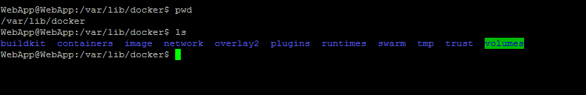

## Installation  
It is recommend to check before installing docker software whether docker is already available or not by using "docker --version".

* if response is empty, install the docker using below commands.
    
         sudo apt install docker.io  for ubuntu
         sudo dnf install docker-ce for redhat

* To check whether the docker installed or not

        docker --version 

* Start docker service and check the status using below commands for ubuntu and rhel.
    ### Ubuntu
        sudo systemctl start docker
        sudo systemctl enable docker
        sudo systemctl status docker
    ### Rhel
        sudo systemctl enable --now docker
        systemctl is-active docker
        systemctl is-enabled docker

Once docker is installed, the complete related information will be available in path of /var/lib/docker on server.

[<- Back to Volumes](./DockerVolumes.md) - - - [Back to Testing Applications](../../../TestingApplications.md) - - - [Ahead to Docker Container Example ->](./UtilizationInSDN.md)