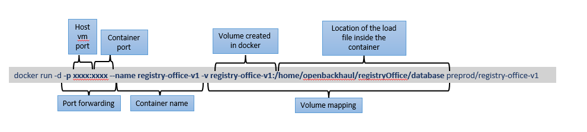

## Docker build and deploy procedure 

Creation and deployment of docker container in docker engine is explained with following examples.

#### Pictorial representation of one application and deployment overview

Using below procedure, created all applications as container on app server and below is the example for one application.

### Context :
The applications are deployed as container which has database in the form of json file. This file will be modified based on certain actions and  this data needs to be persisted. So, to persist the data/get backed up, create persistent volume for every application in the docker environment. 
	
#### Steps to create docker volumes
* Create a docker volume and then use this volume while running the container.

        docker volume create <volumeName>
        ex: docker volume create registry-office

* After creating volumes , to make sure whether it is created, the below command can be used.
       
        docker volume inspect <volumeName>
        ex: docker volume inspect registry-office

* Default path in the servers are for the volumes are available in **/var/lib/docker/volumes**

        Example : WebApp@WebApp:/var/lib/docker/volumes$ pwd
        /var/lib/docker/volumes
        WebApp@WebApp:/var/lib/docker/volumes$ ls
        administrator-administration-v1 metadata.db  oam-log-v1  registry-office-v1     type-approval-registry-v1
        application-layer-topology-v1  

#### Build/load image and deploy containers :
Once volumes are created, attach these to the containers and storage will be mounted as database/filesystem to current created container from the docker application build image. 

While running the applications as container, the created volumes will be maintain the application configured data.
* To build image from the scratch
        
        sudo docker build -t <image-name>
        ex: sudo docker build -t registry-office-v1
        
* To Load image from existing image tar file
        
        sudo docker load -i <imagetarfile>
        ex: sudo docker load -i registry-office-v1

* To run container and attach/map the volume
        
        sudo docker run -d -p <port>:<port> --name <imagename> -v <volumename>:<pathtomount><localmountedpath>
        ex : sudo docker run -d -p <1234>:<1234> --name registry-office-v1 -v registry-office-v1:/home/openbackhaul/registryOffice-v1/database /home/registry-office-v1

* Check container status using below command
        
        docker ps 
        example: WebApp@WebApp:/var/lib/docker$ docker ps
        207f3f43e0e2   cicd_user/registry-office-v1               "docker-entrypoint.s…"   23 hours ago   Up 2 hours         0.0.0.0:xxxx->xxxx/tcp, :::xxxx->xxxx/tcp  
        
[<- Back to Installation](./Installation.md) - - - [Back to Testing Applications](../../../TestingApplications.md) - - - [Ahead to Debugging ->](./DebuggingContainer.md)