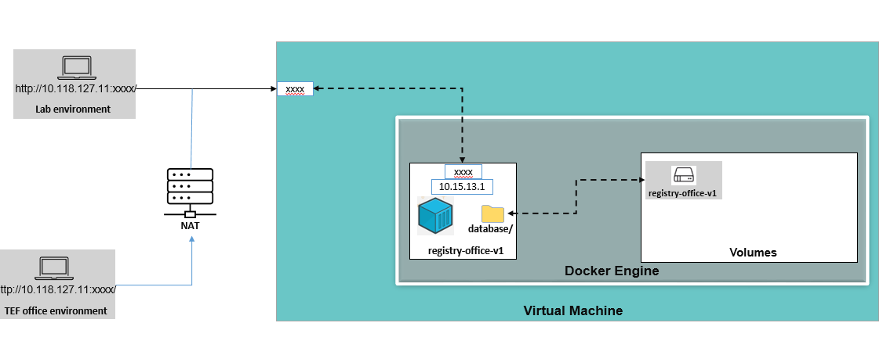

## Docker Usage in Microwave SDN Laboratory and Application Pattern Deployment : 

To create and deploy the containers in a docker engine , we are following the procedure as below.

Please find the example flow below:

#### Context :
We are creating containers for the applications which are having database in the form of json file. This file will be modified based on certain actions. And this data needs to be persisted. So, to persist the data/get backed up, we are creating persistent volume for every application in the docker environment. 
	
#### Steps :
* Create a docker volume and then use this volume while running the container.

        docker volume create <volumeName>
        ex: docker volume create registry-office

* After creating volumes , to make sure whether it is created by using, 
        docker volume inspect <volumeName>
        ex: docker volume inspect registry-office

#### Building images and creating containers :
Once created the volumes, attach these to the containers and storage will be mounted as database/filesystem to current created container from the docker application build image. 

While running the applications as container, the created volumes will be maintain the all application configured data.
* To build image,
        sudo docker build -t <image-name>
        ex: sudo docker build -t registry-office-image
* To run container and attach/map the volume,
        sudo docker run -d -p <port>:<port> --name <imagename> -v <volumename>:<pathtomount><localmountedpath>
        ex : sudo docker run -d -p <1234>:<1234> --name registry-office-image -v registry-office:/home/openbackhaul/registryOffice/database /home/registry-office
        
#### Dockerize SDN Application with RegistryOffice example

[<- Back to DockerVolumes](./DockerVolumes.md) - - - [Back to Testing Applications](../../../TestingApplications.md)
