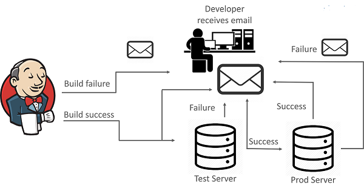
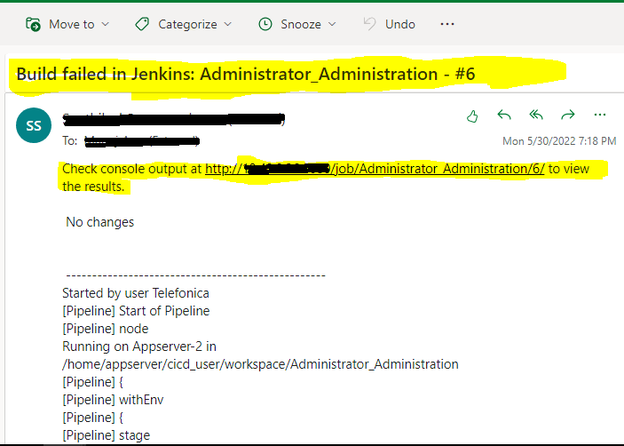

## Email Notification configuration
To get Notified us about the build status and testing results to the team, Jenkins provided email feature. We can configure this to all jobs.

Jenkins has a service of Email
Notifications to handle below situations.

* If the build is not successful then the team of developers is notified about the status of the build. This can be done with the help of an Email plugin in Jenkins. 

* Using the email plugin, can configure the email details of the responsible person who should be notified in case of build failure.

* Once the developer is notified about the error, he then fixes it and again commits the code to GitHub. After this Jenkins again pulls the code from GitHub and prepares a fresh build.

Similarly, Jenkins can solve the problem of the application going down after the release, by notifying the concerned team, via email.

### Example Email:

[<-Back to MasterSlaveConfiguration](./MasterSlaveConfiguration.md) - - - [Back to main TestingApplications](../../../TestingApplications.md) - - - [a head to Jenkins Jobs for SDN Project ->](./JenkinsJobsAndSDNDeployment.md)