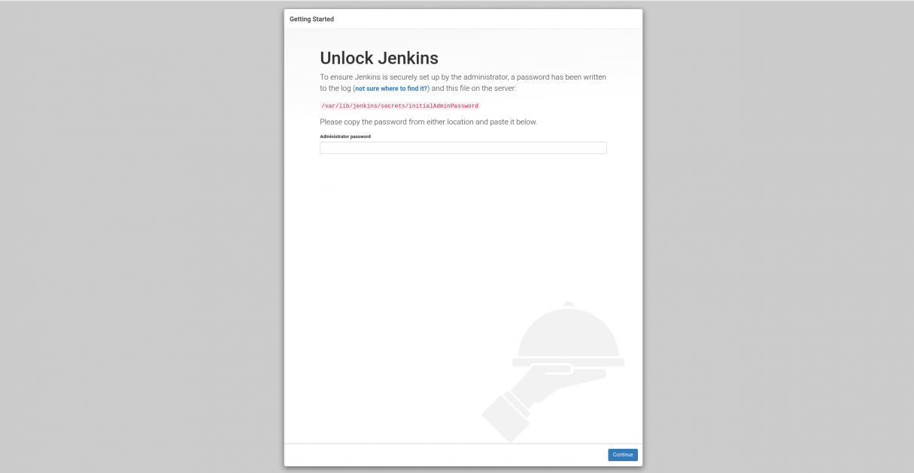
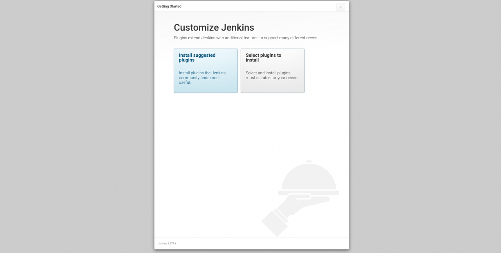
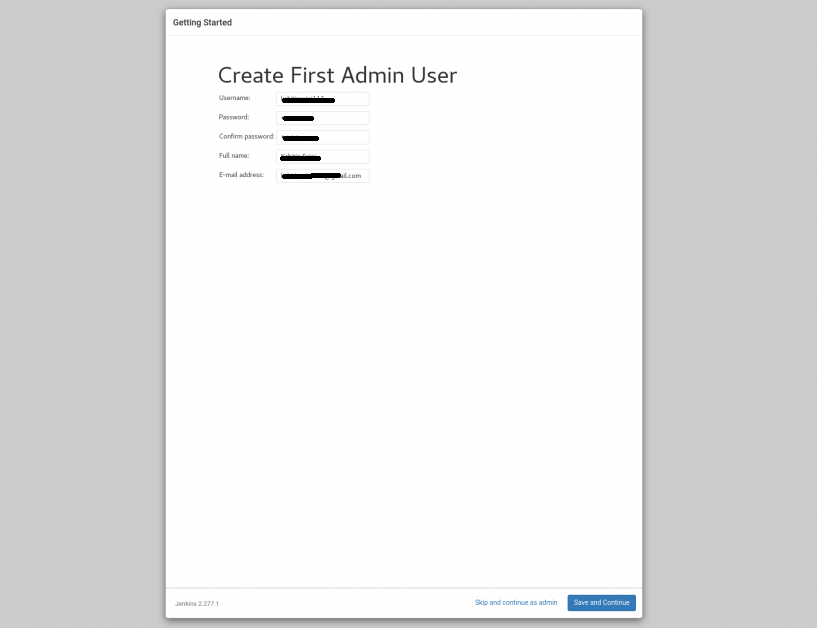
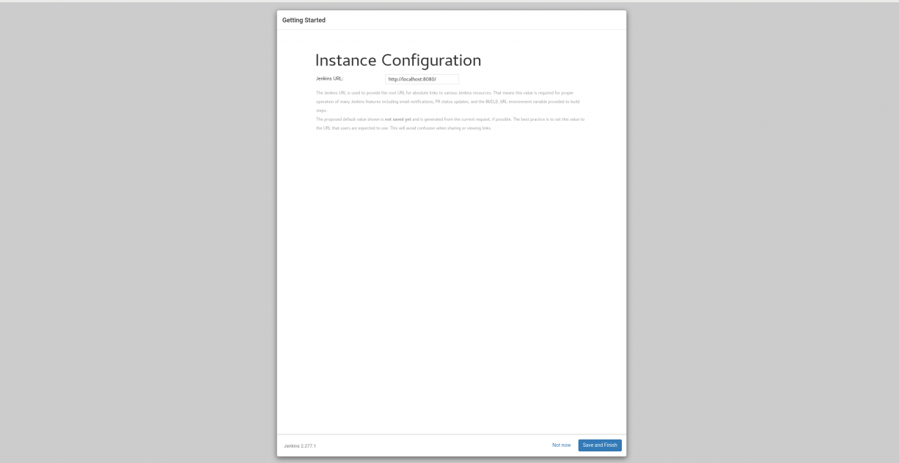
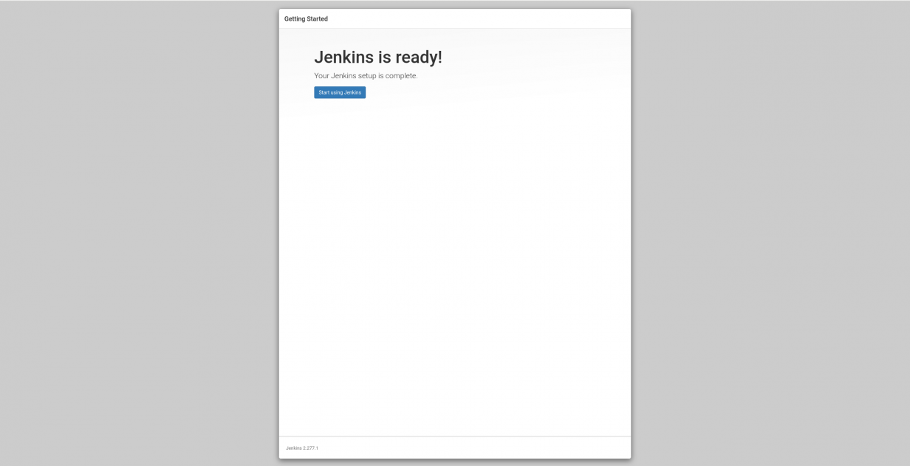
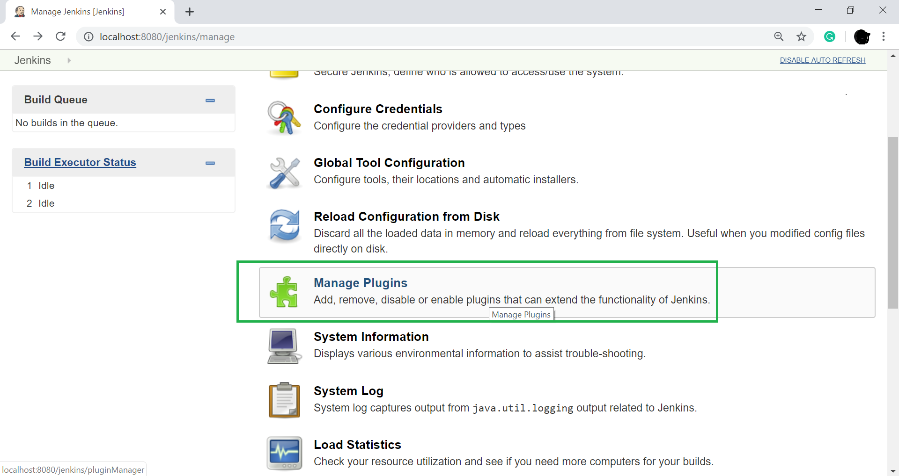

## Install Jenkins and Environment Setup:
**Concepts**

* ### [Prerequisites](#prerequisites)
* ### [Jenkins-installation-steps](#Jenkins-installation-steps)
* ### [Enabled firewall support for XXXX(default 8080) port](#enabled-firewall-support-for-xxxxdefault-8080-port)
* ### [Install all required plugins](#install-all-required-plugins)
* ### [Installing it through our Jenkins dashboard](#installing-it-through-our-jenkins-dashboard)
* ### [Download and install manually](#download-and-install-manually)
* ### [Configure master-slave configuration](#configure-master-slave-configuration)
&nbsp;

### Prerequisites:
Before installing the jenkins, it is recommend to check whether the java installed or not. Based on OS, choose the installation commands.

### Install Java:
     apt install default-jre for ubuntu
     apt install default-jdk for ubuntu
     
     dnf update for rhel
     dnf install java-1.8.0-openjdk-devel #install JDK 8
     dnf install java-11-openjdk-devel #install JDK 11

    Check the version to verify whether installed or not.
     java –version
     javac –version

Referral links:
* [Install Jenkins on ubuntu steps](https://www.digitalocean.com/community/tutorials/how-to-install-java-with-apt-on-ubuntu-18-04)
* [Install Jenkins on rhel steps](https://www.tecmint.com/install-java-on-rhel-8/)

**Jenkins-installation-steps:** 

It is recommend to update the local repository server using "**apt update**" and  install the jenkins.

    apt install Jenkins for ubuntu
    yum install Jenkins for redhat
    
  **Start Jenkins:** : Let’s start Jenkins by using systemctl
  
        systemctl start jenkins
        
  **Status Jenkins:** : Check the status using below command
  
        systemctl status jenkins
        
If everything went well, the beginning of the status output shows that the service is active and configured to start at boot: 

**Output**

    jenkins.service - LSB: Start Jenkins at boot time 
    Loaded: loaded (/etc/init.d/jenkins; generated) 
    Active: active (exited) since Fri 2020-06-05 21:21:46 UTC; 45s ago 
     Docs: man:systemd-sysv-generator(8) 
     Tasks: 0 (limit: 1137) 
     CGroup: /system.slice/jenkins.service 

Once Jenkins is up and running, let’s adjust our firewall rules so that we can reach it from a web browser to complete the initial setup. 

**Enabled firewall support for XXXX(default 8080) port:**

Now Jenkins is up and running on XXXX port.

    Firewall-cmd - -list-all
    Firewall-cmd - -add-port=XXXX/tcp - -permanent

Once we done the installation and firewall setup, the Jenkins is running on  
    
    http:<server-Ip>:<port>

**Unlock Jenkins** :

Once opened the URL, which displays the location of the initial password on unlock screen and enter the password key from /var/lib/jenkins/secrets/initialAdminPassword file. You can access Jenkins by providing the password after reading the file. 

**Image**

The next screen presents the option of installing suggested plugins or selecting specific plugins then go ahead with suggested plugins.

Wait for sometime to install and setup the Jenkins environment with suggested plugin's. Create an admin user. Make sure you remember the username and password, as they are the credentials for accessing the Jenkins WebUI. 

specify if you wish to change the port for Jenkins or else continue with the default port. 

 
Jenkins setup is complete and it can be accessed with the URL that is configured for it. 
Then click on the **start Using Jenkins** to open the Jenkins Dashboard. 

### Install all required plugins
  In Jenkins by default, we install all required plugins while installing Jenkins. If required any other plugins, we can install manually after configuring Jenkins by the below procedure. 

Example required plugins: 
 GitHub integrated plugin
 Docker plugin 
 JUnit Plugin 
Pipeline Utility Steps and etc.

There are two methods for installing plugins in Jenkins:

* Installing it through our Jenkins dashboard
* Downloading the plugin from Jenkins website and installing it
manually.

### Plugin manager
The Plugin Manager allows us to manage to enable and disable the plugins and to edit a plugin's details and options. It is also useful for quickly enabling/disabling multiple plugins. 

### Installing it through our Jenkins dashboard
To install plugins first login into Jenkins under Jenkins Dashboard left side we have manage Jenkins options click on that then select manage plugins and under available section search for required plugin and select it then click on install without restart.

For example now we are trying to integrate the git plugin in Jenkins and find the steps below.

In the Home screen of the Jenkins (Jenkins Dashboard), click on the Manage Jenkins option on the left hand side of the screen.

* click on the Manage Plugins option.

* click on the "Available tab".

* The "Available" tab show us a list of plugins which are available for downloading. In Filter tab and enter the "Git Plugin" and select the plugin and Click on the "install without restart". 
We can also click on "Download now and install after restart" button in which the git plugin is installed after restart.

* To check Git plugin installed then go to "Installed" tab and check.

The procedure is same for all other required plugin installation.

#### Downloading the plugin from Jenkins website and installing it manually.

If any plugins we required to upgrade or downgrade first, we download plugins from official plugins site in our local then upload it to Jenkins. Refersite for [Downloadnewplugins](https://updates.jenkins-ci.org/download/plugins/).

**Note**: download plugins with .hpi extension. 

To upload plugins to Jenkins Goto, Manage Jenkins==>manage plugins==> under advance section ==>under deploy plugin click on choose file then upload earlier download plugin.

### Configure master-slave configuration for deploying application 

The Jenkins master acts to schedule the jobs, assign slaves, and send builds to slaves to execute the jobs. It will also monitor the slave state (offline or online) and get back the build result responses from slaves and the display build results on the console output. 

Open Jenkins Dashboard==>Click on Manage Jenkins==>Click on Manage Nodes and Clouds==>Newnode. Once configured the server with node details and home directory. 

The complete set up is ready in current SDN controller application testing.

<- [Back to Introduction of Jenkins](./Introduction.md) --- [head to main TestingApplications](../../../TestingApplications.md) ---> [EmailNotificationConfiguration](EmailNotificationConfiguration.md)