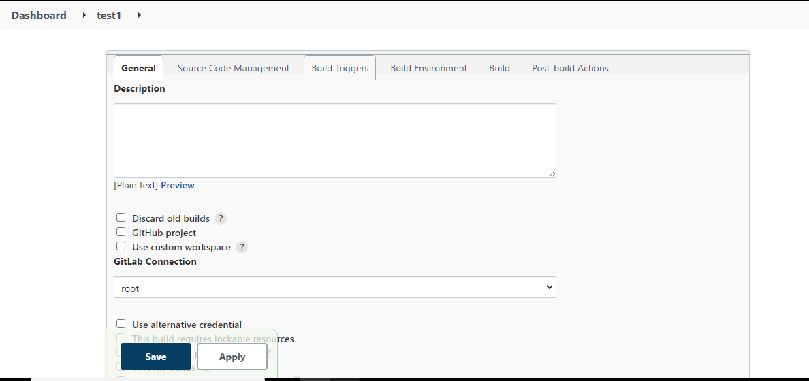

### Jenkins Jobs  creation
In the current setup, sdn environment using below types of automated jobs 
* Freestyle project jobs
* Pipeline jobs (Declarative Pipelines)

Steps to create and configure the jobs
*   Goto Jenkins home Dashboard
   *   Click on "NewItem"
   *   Add user defined job name in field of "Enter an Item Name"
   *   Select the required Job Type (ex: freestyle project/pipeline)
   *   Click On "OK"
   *   It will direct to Job configuration page
   *   Configure the job based on requirement if selected job is pipeline then add a pipeline script
   *  "Apply" and "Save"

### Below are the list of Jobs in current SDN project.

- PollSCM trigger jobs for auto builds whenever new commits merged in remote repositories.
- Automated Mediator upgrade and readonly data testing using free style jobs.
- Automated scheduled/cron sanity testing using free style jobs.
- Automated Controller upgrade.
- Version wise dockerized pipeline jobs for application deployments.
- Acceptance and Integration testing jobs for application pattern applications.

[<-Back to MasterSlave configuration](./MasterSlaveConfiguration.md) - - - [Back to main TestingApplications](../../../TestingApplications.md)
