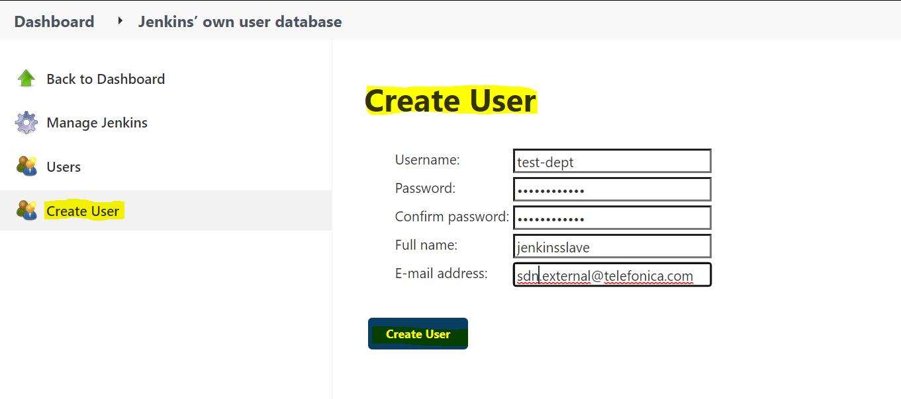
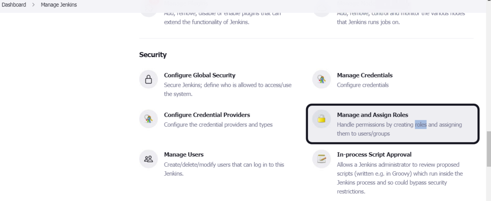

### Create/Add Users in Jenkins & Manage Access levels

In large organizations, there are multiple separate teams to manage and run jobs in Jenkins. By default, Jenkins comes with very basic user creation options. Adminuser can create multiple users but can only assign global roles and privileges to them.

The Role Strategy Plugin enables to assign different roles and privileges to different users. To get this feature, need to install this plugin in Jenkins environment.

**Steps to Enable the Role-based access**
- Install "Role-based Authorization Strategy" plugin in Jenkins.
- Enabling plugin in Global security section.
- Create/Add a User in Jenkins.
- Manage Users and Roles in Jenkins
- Assign Roles in Jenkins to users.
- Create Project Roles in Jenkins.

**Install Role strategy Plugin in Jenkins**

Installing plugin through Jenkins dashboard as follow.

* First login into Jenkins.
* Go to Jenkins Dashboard"Manage Jenkins" and click on it
* Click on "Manage Plugins2 option
* In the available section, "search" for “role”.
* Select "Role-based Authorization Strategy" plugin
* Click on “Install without restart” 

-   Once plugin is installed, a “success” status will be displayed.

**Enabling plugin in Global security section**

* Go to "Manage Jenkins" 
* click on "Configure Global Security"  
* select the checkbox of "Enable securityUnder", 
* Go to section "Authorization," 
* Select radio button "Role-Based Strategy"
* Click on "apply" and "Save".

**Create/Add a User in Jenkins**

* Goto "Manage Jenkins"  
* Under "security" section click on "Manage users"  
* click on "create user"  
* enter user credentials 
* click on "create user"

On the dashboard displays that a new user is added to users list.

**Manage Users and Roles in Jenkins**

It can define the roles by using the *Manages Roles* screen. It is possible to define global and project/agent-specific roles. 

Following are the steps on how to manage and assign roles for users:

-   Go to "Manage Jenkins"
-   Under security section Select "Manage and Assign Roles"

**Note:** The "Manage and Assign Roles" option will only be visible if already installed the role strategy plugin.

-   Click on "Manage Roles" to add new roles

To create a new role we have to follow the below procedure and here explaining  with the help of “tester” role,
-   Go to "Global roles" section
-   Create “tester” role under "Role to add" column.
-   Click on “Add” to create a new role.
-   Now, select the Jenkins user permissions based on user access level of “tester” role.
-   Click Save

**Assign Roles in Jenkins**

You can assign roles to users and user groups using the "Assign Roles" screen

-   User groups represent authorities provided by the Security(e.g. LDAP plugin can provide groups)
-   There are also two built-in groups: authenticated (users who logged in) and anonymous (any users, including ones who have not logged in)

Now that you have created roles, let us assign them to specific users.

-   Go to "Manage Jenkins"
-   Select Manage and Assign Roles

We shall add the new role “tester” to user “tester”

-   Select "tester" role checkbox for tester user
-   Click Save

 As per requirement, We can create and assign any role to any user.

**Create Project Roles in Jenkins**

We can create project specific roles under "Project Roles" for group of people in team.

-   Go to "Manage and Assign Roles"
-   Enter a role as “tester”
-   Add a pattern like "tester.\*"(so that any username
starting with “tester” will be assigned the project role)
-   Click "Add"
-   Select privileges/access levels
-   Click "Apply" and "Save"

[<-Back to PluginInstallation](./PluginInstallation.md) - - - [Back to main TestingApplications](../../../TestingApplications.md) - - - [a head to MasterSlaveConfiguration->](./MasterSlaveConfiguration.md)
