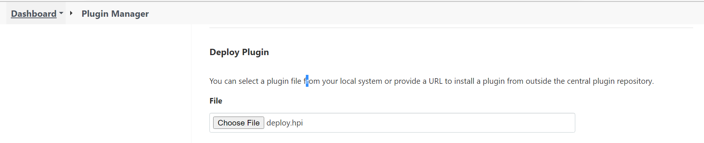
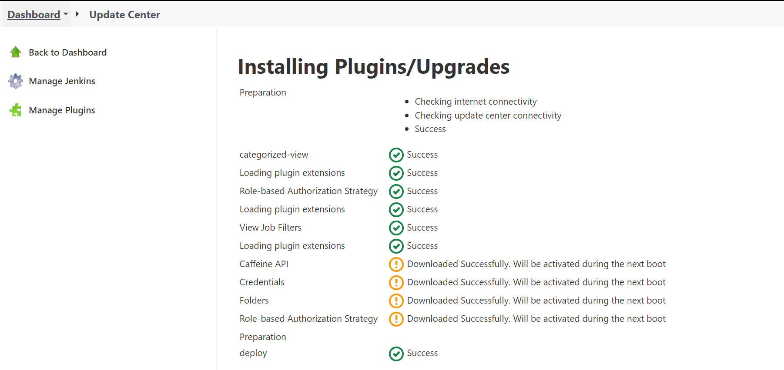

### Install Plugins
  In Jenkins by default, adminuser installs all required plugins while installing Jenkins. If required any other plugins, adminuser can install manually after configuring Jenkins by below procedure. 

### Plugin manager
The Plugin Manager allows to manage, enable and disable the plugins and to edit a plugin's details and options. 

There are two methods for installing plugins in Jenkins

* Installing plugins through Jenkins dashboard
* Downloading the plugin from Jenkins website and installing it manually.

### Installing plugins through Jenkins dashboard
* To install plugins first login into Jenkins. 
* Jenkins Dashboard left side, select “Manage Jenkins”, click on it.
* Select “Manage Plugins” 
* Select the "Available" tab section and search for required plugin and select it then click on install without restart.

The procedure is applicable for other required plugin's installation in Jenkins. Below is one of the example plugin (GIT plugin) installation that required for SDN setup. 

In the Home screen of the Jenkins (Jenkins Dashboard), click on the Manage Jenkins.

* click on the Manage Plugins option.

* click on the "Available" tab.

* The "Available" tab shows a list of plugins which are available for downloading. In Filter tab, enter "GIT Plugin" and select the plugin and Click on the "install without restart". 
User can also click on "Download now and install after restart" button in which the git plugin is installed after restart.

* To check Git plugin installed then go to "Installed" tab and check.

**Note:** The procedure is same for all other required plugin installation.

#### Download the plugin from Jenkins website and installing it manually.

If any plugins user required to upgrade or downgrade first, User can download plugins from official plugins site in our local then upload it to Jenkins. Refer the site for [Downloadnewplugins](https://updates.jenkins-ci.org/download/plugins/).

**Note**: download plugins with .hpi extension only.

* Download the plugin from the Jenkins Plugin page. 
* Go to the Jenkins Home page and click "Manage Jenkins".
* Select "Manage Plugins" and then "Advanced" tab.
* go to "Deploy Plugin" and click "Choose File" and select the plugin file(.hpi) downloaded.

* Click Deploy and Jenkins will install the plugin

* Restart the Jenkins server for the changes to take effect.

[<-Back to EnvironmentSetup](./EnvironmentSetup.md) - - - [Back to main TestingApplications](../../../TestingApplications.md) - - - [a head to ManageUsers and Access levels->](./ManageUsers.md)