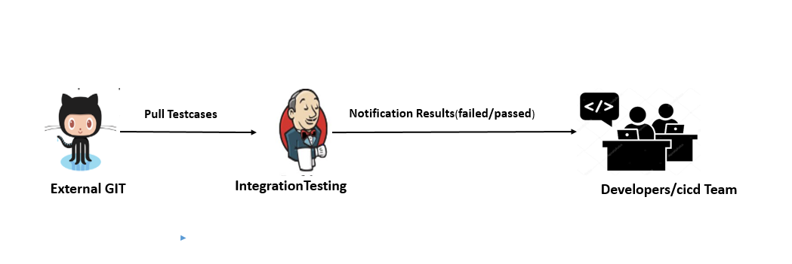

## Integration Testing automation procedure 
Once Application deployed and automatically testsuites execution performed on production test server.

As a prerequisite, the related test tools mentioned earlier to be installed and set up should done the server.

* GIT is a version control system which holds the source code of applications and automated testsuites.
* Developers can develop the source code and test suites and pushed to github.
* Jenkins has integration pipeline job created by user with all configuration and run collects the test results.
* The notification generated to configured users from jenkins pipeline.

### Procedure for automated testing:

### Configure Pipeline job for running Acceptance test cases

Please refer the previous section for [creating the jenkins job](../Tools/Jenkins/JenkinsJobsAndSDNDeployment.md#list-of-jenkins-jobs)

### Build the declarative pipeline script
Once job is created, please follow the below procedure to build the groovy script for testing.

        procedure to build the groovy script for testing.

        pipeline {
    agent {
        label 'test_server'
    }
    stages {
      stage ('source stage') {
           steps {
                git branch: 'develop', url: '<github repository link>' 
             }
            }
        }
        stage ('Setup to run testsuite collections') {
            steps {
                 dir ('/var/lib/jenkins/workspace')
                    {
                        <Update the configuration according to testing requirements in input file of applications>

                }
            }
        }
        stage ('run Integration test cases using newman') {
            steps {

                 dir ('/var/lib/jenkins/workspace/<jobworkspace>/')
                    {
                    
                   sh 'newman run <collectionfile> -d <inputfile> -r htmlextra,cli --reporter-htmlextra-logs'
                }
            }
        }  
        stage ('Print test results in workspace dir.') {
            steps {

                 dir ('/var/lib/jenkins/workspace/<jobname>/newman')
                    {
                    sh 'ls -lrt'
                }
            }
        }
    }
    environment {
            EMAIL_TO = '<mention mail id>'
        }
    post {
    	success {
                emailext body: 'Check console output at $BUILD_URL to view the results. \n\n ${CHANGES} \n\n -------------------------------------------------- \n${BUILD_LOG, maxLines=100, escapeHtml=false}', 
                        to: "${EMAIL_TO}", 
                        subject: 'Successfull Build in Jenkins: $PROJECT_NAME - #$BUILD_NUMBER'
        }
    	failure {
                emailext body: 'Check console output at $BUILD_URL to view the results. \n\n ${CHANGES} \n\n -------------------------------------------------- \n${BUILD_LOG, maxLines=100, escapeHtml=false}', 
                        to: "${EMAIL_TO}", 
                        subject: 'Build failed in Jenkins: $PROJECT_NAME - #$BUILD_NUMBER'
        }
        unstable {
                emailext body: 'Check console output at $BUILD_URL to view the results. \n\n ${CHANGES} \n\n -------------------------------------------------- \n${BUILD_LOG, maxLines=100, escapeHtml=false}', 
                        to: "${EMAIL_TO}", 
                        subject: 'Unstable build in Jenkins: $PROJECT_NAME - #$BUILD_NUMBER'
        }
        changed {
                emailext body: 'Check console output at $BUILD_URL to view the results.', 
                        to: "${EMAIL_TO}", 
                        subject: 'Jenkins build is back to normal: $PROJECT_NAME - #$BUILD_NUMBER'
        }
    }
    }

#### Source stage 
Cloning the latest source code from the github.

#### Setup to run collections 
- Update the file <inputfile.date.time+data.no.json> with "typeOfTesting": "Integration"
- Update <inputfile.date.time+data.no.json> file with proper "userName" and authorizationCode" to access the applications from Jenkins
-  Update <inputfile.date.time+data.no.json> file with  "serverUrl" with current URL of application which is up and running
- Finally, makesure that the application loadfile properly updated with latest data (Ip address and Ports of applications in database).

#### Run the test suites using newman
To run the suite, we are using below command.

 newman run <postmancollectionjsonfile> -d <inputfile.date.time+data.no.json> -r htmlextra,cli --reporter-htmlextra-logs

     Example: newman run RegistryOffice_0.0.1_tsi.date.time+testcases.1.postman_collection -d RegistryOffice_0.0.1_tsi.date.time+data.no.json -r htmlextra,cli --reporter-htmlextra-logs

#### Results available:
As part of pipeline configuration setup and running the test suites and also configure respective suite workspace. Means after executing the suites, the results are available in this workspace which is a server path of **/var/lib/jenkins/workspace/< suitename>/newman**

    Example path for RO suite and collected results :

    on server: /var/lib/jenkins/workspace/RO_Testcases/newman

    url to access the job: http://10.0.3.4:1234/view/Applications/job/Registry_Office/2/

#### Email Notification

Email notification configuration done as part of groovy script only. Once test suite execution is completed, the notification with execution reports and job URL's sent to configured users from jenkins pipeline.

[<-Back to main Testing Applications->](../../TestingApplications.md)
