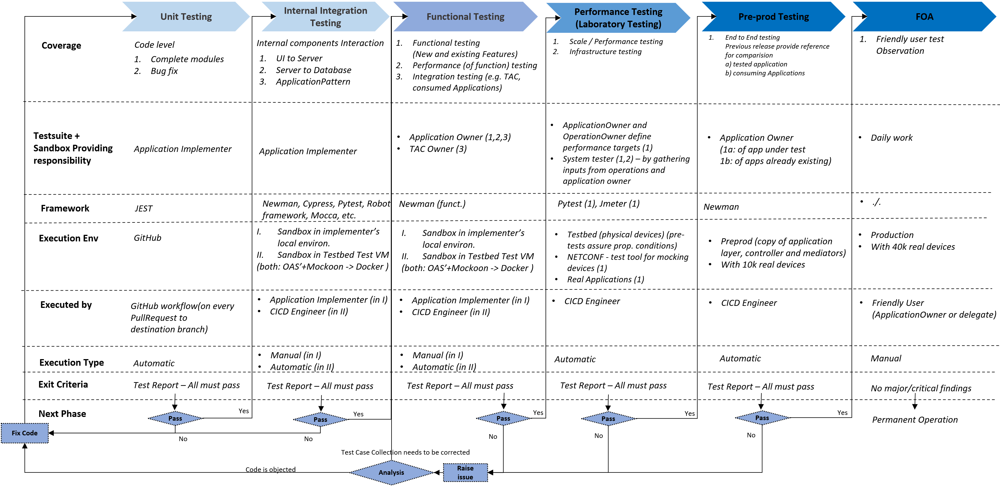

# Applications Deployment and Testing  
## Structure of Testing  
The following picture represents the updated proceeding for testing applications agreed on 4th of October 2024.  
If there would be conflicts with other chapters of this documentation, these chapters would required updating.   
**Essential aspect:**  
Humans don't test.  
Test case collections are coded and will be automatically executed.  
They will just produce a binary result.  
In case of pass, the applications are automatically instantiated in the next stage of the process (incl. live network at the end).  
In case of failure, the test case collection is analysed for errors. If the application does not pass testing with a flawless test case collection, the application is rejected and returned back to the implementer for corrections.

## Infrastructure
### SDN Laboratory
Software Defined Networking (SDN) is an architecture that uses open protocols to provide centralized, programmatic control and network device monitoring. In SDN laboratory, applications deployment is performed on app server and related testing on test server.

**Concepts**
* [Overview](./Infrastructure/SdnLaboratory/Overview/OverviewandGeneralConcepts.md)

### Fake Addresses
**Concepts**
* [Fake IP Addresses](./Infrastructure/SdnLaboratory/FakeAddresses/IpAddresses.md)
* [Fake Index Aliases](./Infrastructure/SdnLaboratory/FakeAddresses/IndexAliases.md)

**Step-by-Step Guidelines**

A user can update the applications with proper actual addresses in two ways.
* Manually updating IP address and TCP port for each application from respective swagger API's.
* Automated updating through script developed that could update the load.json file for the respective application. This script needs to be run once while deployment. Refer this for further details [FakeToOriginalIPConverter](../../server/FakeToOriginalIPConverter/README.md)

## Tools
To achieve automated testing and deployment process, requires a SDN pipeline dockerize environment setup using below mentioned tools,   which give how NodeJS applications deploy as a docker container through Jenkins and running automated test suites for every commit from GitHub develop branch.
### Jenkins
Jenkins is an open source continuous integration/continuous deployment (CI/CD) automation software tool written in Java programming language. It helps to automate the software activities like building, testing, deploying which makes easier to developers to deliver the Software modules. It is the leading tool for CI.

**Concepts**
* [Jenkins Workflow](./Infrastructure/Tools/Jenkins/Jenkinsworkflow.md)
* [Email Notifications](./Infrastructure/Tools/Jenkins/EmailNotificationConfiguration.md)

**Step-by-Step Guidelines**
* [Jenkins Installation](./Infrastructure/Tools/Jenkins/JenkinsInstallation.md)
* [Environment SetUp](./Infrastructure/Tools/Jenkins/EnvironmentSetup.md)
* [Install required plugins](./Infrastructure/Tools/Jenkins/PluginInstallation.md)
* [Manage Users and access levels](./Infrastructure/Tools/Jenkins/ManageUsers.md)
* [Configure master-slave configuration](./Infrastructure/Tools/Jenkins/MasterSlaveConfiguration.md)
* [Jenkins jobs creation](./Infrastructure/Tools/Jenkins/JenkinsJobsAndSDNDeployment.md)

**Documents**
* [Jenkins overview reference](https://www.jenkins.io/doc/tutorials)
* [Download Plugins reference](https://updates.jenkins-ci.org/download/plugins/)

### Git, GitHub
Git is a free and open source distributed version control system and easy to learn. It is used more efficiently to manage Git repositories on centralized server. 
- Keeps track of code history
- Collaborate on code as a team
- See who made which changes
- Deploy code to staging or production

**Concepts**
* [Introduction to Git and GitHub](../PreparingSpecifying/Introduction2Git/Introduction2Git.md)
* [Workflow for contributing](../PreparingSpecifying/WorkflowForContributing/WorkflowForContributing.md)
* [Frequently used Git Adhoc Commands](./Infrastructure/Tools/Git/GitCommands.md)

**Step-by-Step Guidelines**
* [Creating an own GitHub account](../PreparingSpecifying/OwnGitHubAccount/OwnGitHubAccount.md)
* [Installing Git](../PreparingSpecifying/InstallingGit/InstallingGit.md)

 **Documents**
* [More about Git commands](https://docs.github.com/en/get-started/using-git/about-git ) 

### Docker
Docker is an open source platform that enables developers to build, deploy, run, update and manage containers of applications. It is used to automate the deployment of software in lightweight containers which can run on any OS environment. These containers helps applications to work efficiently in different environments.

**Concepts**
* [Docker objects](./Infrastructure/Tools/Docker/DockerIntroduction.md#docker-objects)
* [Docker adhoc commands](./Infrastructure/Tools/Docker/DockerUsefulCommands.md)
* [Docker volumes](./Infrastructure/Tools/Docker/DockerVolumes.md)

**Step-by-Step Guidelines**
* [Docker installation](./Infrastructure/Tools/Docker/Installation.md)
* [Docker build and deploy procedure](./Infrastructure/Tools/Docker/UtilizationInSDN.md)
* [How to debug container using adhoc commands](./Infrastructure/Tools/Docker/DebuggingContainer.md)

**Documents**
* [Docker overview](https://docs.docker.com/get-started/overview/ )
* [Docker adhoc Commands reference](https://docs.docker.com/engine/reference/commandline/docker/)
* [Docker volumes reference](https://docs.docker.com/storage/volumes/)
### Newman and Newman-reporter-htmlextra
Newman is a command-line collection runner for Postman. It allows to run and test a postman collections directly from the command-line. It used for testing and validating APIs as well.

Newman-reporter-htmlextra is an open-source node.js package which provides an HTML reporter for Newman. It generates detailed HTML reports for the collections includes the total number of requests, response time, and error messages for each testcase in collection. 

**Step-by-Step Guidelines**
* [Newman Installation](./Infrastructure/Tools/Newman/Newman.md#install-newman-and-newman-reporter-htmlextra)
* [Newman options and Usage](./Infrastructure/Tools/Newman/Newman.md#basic-options-and-usage)

**Documents**
* [Newman reference](https://learning.postman.com/docs/running-collections/using-newman-cli/newman-options/)

### HAScripts
HighAvailability is an ability to monitor/operate the services continuously with minimal of zero failures. Current architecture have multiple instances of applications running and if one of them crashes, still have the other instances working and available. HA will make sure that all instances are up and running, If required will resume the crashed instances also.

**Step-by-Step Guidelines**
* [HA Script Usage](./Infrastructure/Tools/Scripts/Scripts.md)

## SDN Application Pattern Deployment
 Application pattern is build on application layer where the complex applications are run and deploy independently.

**Concepts**
* [WorkFlow](./Infrastructure/SDNApplicationPatternDeployment/WorkFlow.md)

**Step-by-Step Guidelines**
* [Application Deployment in TestBed](./Infrastructure/SDNApplicationPatternDeployment/AppDeploymentInTestBed.md)
* [Application Deployment in Production](./Infrastructure/SDNApplicationPatternDeployment/AppDeploymentInProd.md)

## Acceptance Testing
Acceptance testing is a quality assurance (QA) process and this technique performed to determine whether software system has met user/business requirement specifications. It evaluates quality of software. Acceptance Testing run on testbed environment and if everything ok, then approve and  build go for deployment in production environment.

**Step-by-Step Guidelines**
* [Automated testing procedure](./AcceptanceTesting/Overview/pipelineconfiguration.md) 

## Integration Testing
Integration Testing is finalized testing of software product. Normally software products are divided into different modules and here SDN applications are also developed as individual services. This testing verifies that  software modules are integrated logically and tested as a group. The purpose of this level of testing is to expose defects in the interaction level and checks the proper service/data communications happen among modules/Applications.

**Step-by-Step Guidelines**
* [Automated testing procedure](./IntegrationTesting/Overview/pipelineconfiguration.md)

[<- Back to Specifying](../SpecifyingApplications/SpecifyingApplications.md) - - - [Up to Main](../Main.md) - - - [Ahead to TinyApplicationController ->](../TinyApplicationController/TinyApplicationController.md)
