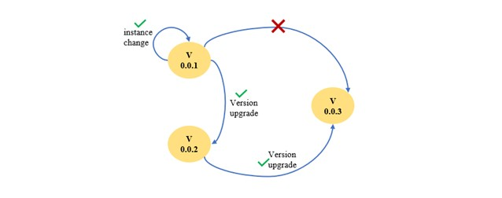
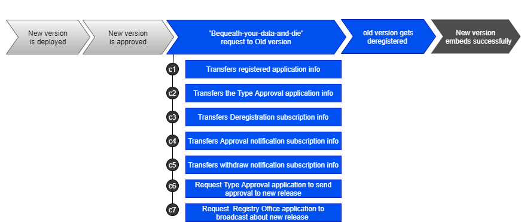
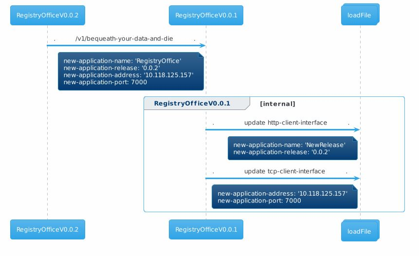
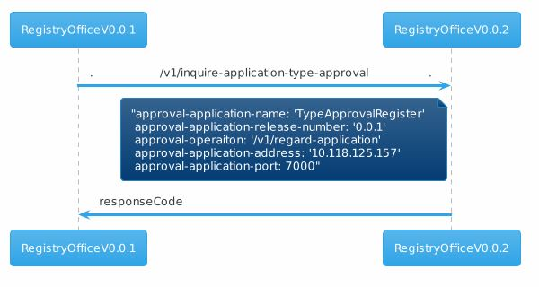
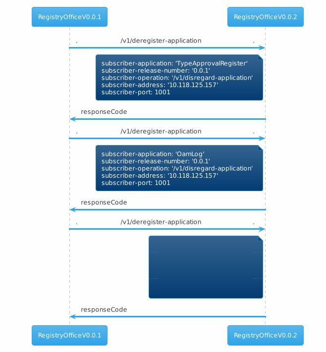
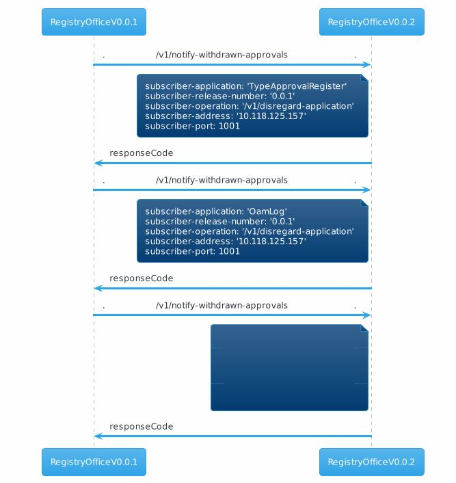
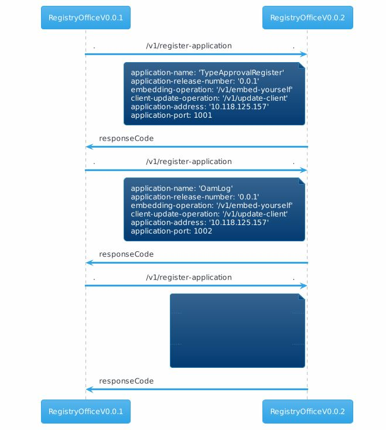
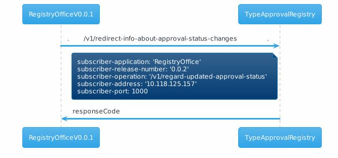
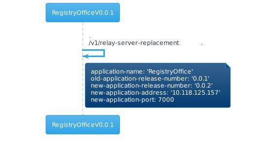
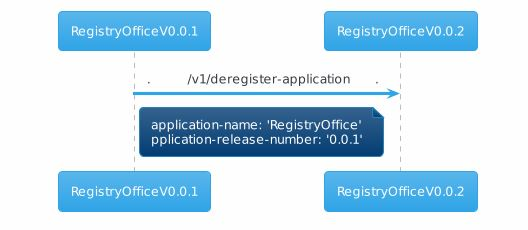

# /v1/bequeath-your-data-and-die

(This document describes a sample implementation, which might be out of synch with actual implementation.)

Ultimate goal of this service is to perform software version or instance upgrade without(or with minimum) downtime. This service will be initiated by a new application to the old(or same) version of the same application. The functionality within this service performs a set of procedure to transfer the data from old application to new application using callbacks.

Every new version will be backward compatible with its immediate previous version for a smooth integration with multiple MS. So, software version upgrades should be sequential in order to have a backward compatible version.

unlike others , this service is not a straightforward one. It has to perform a number of callbacks to transfer the data from old to new version.

To perform upgrade(or instance change) , old and new version of the Registry office will proceed as mentioned below (in a high level),

The callbacks will be executed in the waterfall model. And if one callback fails, then rest of the callbacks will not be performed further.

## Configuration:

When the old version receives the request , to further communicate with the proper application instance of the new version , 
the remote address and port of the "newRelease" will be noted by the old version and so the new release number.
So in the load file of the old release , the http-client-interface and tcp-client-interface will be edited.

## Forwardings:

After successful configuration of the layer protocols, parallel notifications will be triggered for the following forwarding-constructs that corresponds to the update happed in the load file ,
- ServiceRequestCausesLtpUpdateRequestALT : If there is a modification to the logical-termination-point , then the details about that LTP will be updated to the Application Layer Topology application.
- ServiceRequestCausesLoggingRequestEaTL : The service request will be recorded to the Execution and Trace log application.

Apart from the above forwardings , the following callbacks will be initiated to perform the upgrade. Each callback is intended to transfer the existing data from the old release to new release.

**PromptForBequeathingDataCausesNewApplicationBeingRequestedToInquireForApplicationTypeApprovals :**

To make the new application aware about the current TypeApproval Application , this forwarding initiated the v1/inquire-application-type-approval request to the new version and transfers the application information and transport details. 
 > Old application identifies the correct instance by using the "RegistrationCausesInquiryForApplicationTypeApproval" forwardingName

**PromptForBequeathingDataCausesNewApplicationBeingRequestedToDocumentSubscriptionsForDeregistrationNotifications :**

This forwarding is to transfer the information about the applications subscribed for deregistration notification. 
> The subscribed application information will be identified by the "DeregistrationNotification" forwardingName.

**PromptForBequeathingDataCausesNewApplicationBeingRequestedToDocumentSubscriptionsForApprovalNotifications:**

This forwarding is to transfer the information about the applications subscribed for approval notification. 
> The subscribed application information will be identified by the "ApprovalNotification" forwardingName.

**PromptForBequeathingDataCausesNewApplicationBeingRequestedToDocumentSubscriptionsForWithdrawnApprovalNotifications**

This forwarding is to transfer the information about the applications subscribed for withdrawn approval notification. 
> The subscribed application information will be identified by the "WithdrawnApprovalNotification" forwardingName.

**PromptForBequeathingDataCausesTransferOfListOfAlreadyRegisteredApplications :**

This forwarding is to transfer the information about the registered applications. Apart from the &quot;old&quot; and &quot;new&quot; release , all the other application information will be transferred as a part of this callback.

**PromptForBequeathingDataCausesTARbeingRequestedToRedirectInfoAboutApprovalsToNewApplication :**

This forwarding will initiate a request to the &quot;TypeApprovalRegistry&quot; application to redirect the application &quot;approval status change&quot; to the new version.

**PromptForBequeathingDataCausesRequestForBroadcastingInfoAboutServerReplacement:**

This forwarding will initiate a request to the &quot;old Registry office&quot;(that is, to its own) application to broadcast about the new release to all the approved application in the SDN MS environment.

**PromptForBequeathingDataCausesRequestForDeregisteringOfOldRelease :**

At this point of time , the old registry office might have transferred all its data to the new application. 
And now , the new application is the active registry office.

This forwarding will deregister the old Registry Office from the SDN MS environment.

