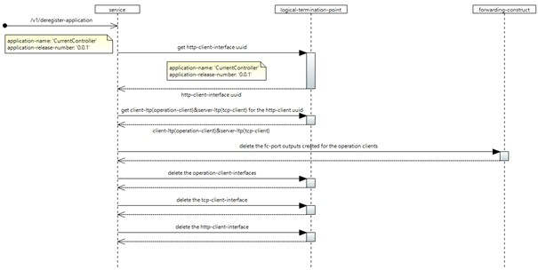
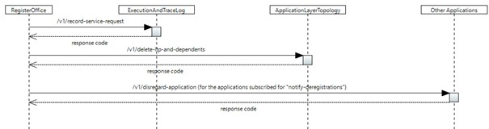

# /v1/deregister-application

(This document describes a sample implementation, which might be out of synch with actual implementation.)

This service allows application to get deregistered from the SDN application layer Microservice architecture. On successful deregistration, RO will broadcast the deregistered application information to other applications that are subscribed for deregistration notification.

## Configuration:

The following interfaces will be removed from the logical-termination-point list in the control-construct,

| **S.No** | **Layer protocol name** | **Details** |
| --- | --- | --- |
| 1 | http-client-interface | For the provided application-name and release-number , if a http-client-interface is available, it will be deleted from the ltp list. |
| 2 | tcp-client-interface | For the identified http-client-interface , the dependent server-ltp will be deleted from the ltp list. |
| 3 | operation-client-interface | For the identified http-client-interface , the dependent client-ltp will be deleted from the ltp list. |

All the dependent fc-port instances for the deleted operation-client instances will be removed from their corresponding forwarding-construct fc-port list.

## Forwarding:

After successful de-registration, parallel notifications will be triggered for the following forwarding-constructs,

| **S.No** | **Forwarding-construct name** | **Details** |
| --- | --- | --- |
| 1 | ServiceRequestCausesLtpDeletionRequest ALT: /v1/delete-ltp-and-dependents | Notifications will be triggered with the deleted LTP instance information to ALT. |
| 2 | DeregistrationNotification All: /v1/disregard-application | Notification will be triggered for all the applications subscribed for de-registration notification. |
| 3 | ServiceRequestCausesLoggingRequestEaTL: /v1/record-service-request | A trigger will be sent to EaTL to record the service request. |

