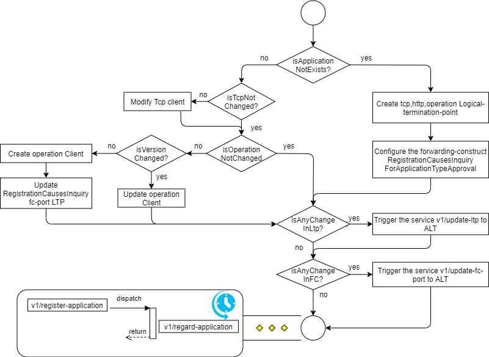
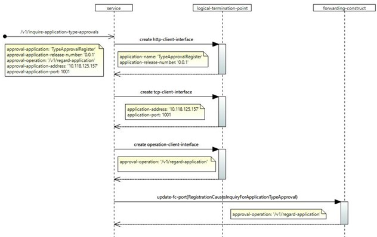
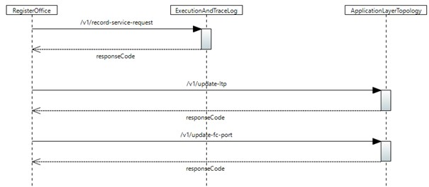

# /v1/inquire-application-type-approvals

(This document describes a sample implementation, which might be out of synch with actual implementation.)

This service allows applications to subscribe for notifications about new registration of applications. As per the specification of the MS architecture , only TAR is the eligible application to subscribe for this notification. However, the implementation will not restrict the subscription based on the application name. A request with a valid operation-key will be processed.

## Configuration:

The following interfaces will be created and added to the logical-termination-point list in the control-construct,

| **S.No** | **Layer protocol name** | **Details** |
| --- | --- | --- |
| 1 | http-client-interface | A new http-client-interface with the details of the application-name and release-number. |
| 2 | tcp-client-interface | A new tcp-client-interface with the ipv4 address and port (where the application is running) |
| 3 | operation-client-interface | New operation-client-interfaces will be created for the operation name provided in the request-body attribute approval-operation. |

The following forwarding-construct configuration will happen,

| **S.No** | **Forwarding-construct name** | **Details** |
| --- | --- | --- |
| 1 | RegistrationCausesInquiryForApplicationTypeApproval | The logical-termination-point of the fc-port will be updated for the new operation-client instantiated for the approval-operation. |

## Forwarding:

After successful processing, parallel notifications will be triggered for the following forwarding-constructs,

| **S.No** | **Forwarding-construct name** | **Details** |
| --- | --- | --- |
| 1 | ServiceRequestCausesLtpUpdateRequestALT: /v1/update-ltp | If a new LTP instance gets created and added to the LTP list, then a trigger will be initiated. |
| 2 | ServiceRequestCausesFcPortUpdateRequest ALT: /v1/update-fc-port | If a new fc-port instance gets created and added to the TypeApprovalCausesRequestForEmbedding FC, then a trigger will be initiated. |
| 3 | ServiceRequestCausesLoggingRequestEaTL: /v1/record-service-request | A trigger will be sent to EaTL to record the service request. |

