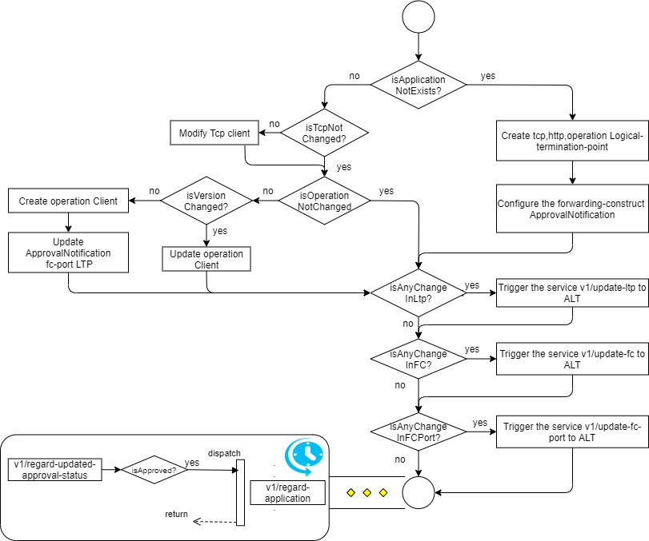
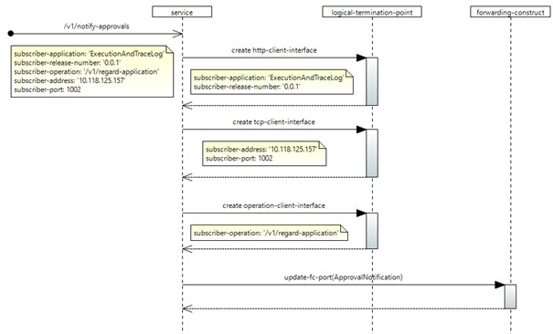

# /v1/notify-approvals

(This document describes a sample implementation, which might be out of synch with actual implementation.)

This service allows applications to subscribe for notifications about application approval. Whenever the Type Approval Application approves an application , a callback will be initiated for the applications subscribed for this notification. Any application with a valid operation key can subscribe for this service.

## Configuration:

The following interfaces will be created and added to the logical-termination-point list in the control-construct,

| **S.No** | **Layer protocol name** | **Details** |
| --- | --- | --- |
| 1 | http-client-interface | A new http-client-interface with the details of the subscriber-application and subscriber-release-number. |
| 2 | tcp-client-interface | A new tcp-client-interface with the ipv4 address and port (where the application is running) |
| 3 | operation-client-interface | New operation-client-interfaces will be created for the operation name provided in the request-body attribute subscriber-operation. |

The following forwarding-construct configuration will happen,

| **S.No** | **Forwarding-construct name** | **Details** |
| --- | --- | --- |
| 1 | ApprovalNotification | The logical-termination-point of the fc-port will be updated for the new operation-client instantiated for the subscriber-operation. |

## Forwarding:

After successful processing, parallel notifications will be triggered for the following forwarding-constructs,

| **S.No** | **Forwarding-construct name** | **Details** |
| --- | --- | --- |
| 1 | ServiceRequestCausesLtpUpdateRequestALT: /v1/update-ltp | If a new LTP instance gets created and added to the LTP list, then a trigger will be initiated. |
| 2 | ServiceRequestCausesFcPortUpdateRequest ALT: /v1/update-fc | If a new fc-port instance gets created and added to the ApprovalNotification FC, then a trigger will be initiated. |
| 3 | ServiceRequestCausesLoggingRequestEaTL: /v1/record-service-request | A trigger will be sent to EaTL to record the service request. |

