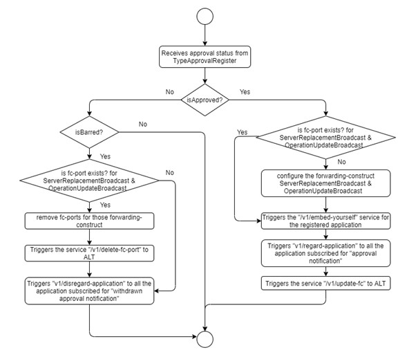
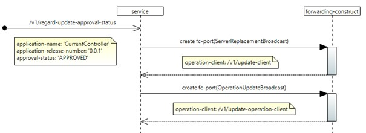
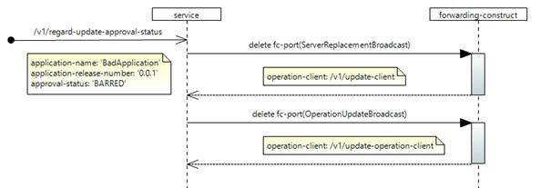
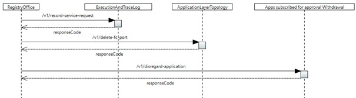

# /v1/regard-updated-approval-status

(This document describes a sample implementation, which might be out of synch with actual implementation.)

This service updates an application&#39;s approval status. Based on the approval status further forwardings will be triggered by RO.

Note : Registry office will never store the approval status of other applications.

## Configuration:

If the application is approved by TAR, then the following forwarding-constructs will be configured according to the corresponding operation-clients,

| **S.No** | **Forwarding-construct name** | **Details** |
| --- | --- | --- |
| 1 | ServerReplacementBroadcast ALL: /v1/update-client | A new fc-port will be created for the operation-client instantiated for the client-update-operation. |
| 2 | OperationUpdateBroadcast All: /v1/update-operation-client | A new fc-port will be created for the operation-client instantiated for the service /v1/update-operation-client. |

If the application is barred by TAR, then the following updation will happen,

| **S.No** | **Forwarding-construct name** | **Details** |
| --- | --- | --- |
| 1 | ServerReplacementBroadcast All: /v1/update-client | Existing fc-port will be deleted for the operation-client instantiated for the client-update-operation. |
| 2 | OperationUpdateBroadcast All: /v1/update-operation-client | Existing fc-port will be deleted for the operation-client instantiated for the service /v1/update-operation-client. |

Note : For now , the operation-clients for the respective forwarding-constructs are hardcoded in the business logic.

## Forwarding:

When an application is approved by TAR , the forwardings will be triggered as a consequence ,

| **S.No** | **Forwarding-construct name** | **Details** |
| --- | --- | --- |
| 1 | ServiceRequestCausesFcUpdateRequestALT: /v1/update-fc | If new fc-port instance gets created and added to the ServerReplacementBroadcast, OperationUpdateBroadcast FCs, then a trigger will be initiated. |
| 2 | TypeApprovalCausesRequestForEmbeddingApproved Application: /v1/embed-yourself | The fc-port for the approved application will be executed. |
| 3 | ApprovalNotification All : /v1/regard-application | A trigger will be sent to all the applications that are subscribed for approval notification. |
| 4 | ServiceRequestCausesLoggingRequestEaTL: /v1/record-service-request | A trigger will be sent to EaTL to record the service request. |

When an application is BARRED by TAR , the forwardings will be triggered as a consequence ,

| **S.No** | **Forwarding-construct name** | **Details** |
| --- | --- | --- |
| 1 | ServiceRequestCausesFcPortDeletionRequestALT: /v1/delete-fc-port | For the barred application , if fc-port instances are available for the ServerReplacementBroadcast, OperationUpdateBroadcast FCs, after deleting the FCs , a trigger will be initiated. |
| 2 | WithdrawnApprovalNotificationAll : /v1/disregard-application | A trigger will be sent to all the applications that are subscribed for approval withdrawn notification. |
| 3 | ServiceRequestCausesLoggingRequestEaTL: /v1/record-service-request | A trigger will be sent to EaTL to record the service request. |

