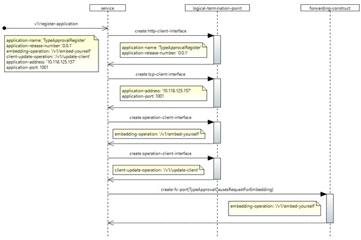
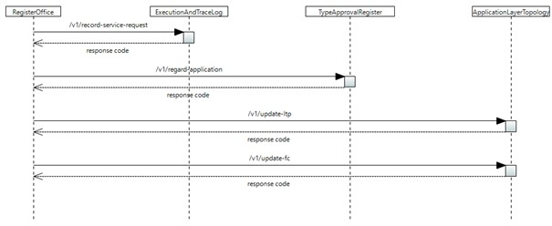

# /v1/register-application

(This document describes a sample implementation, which might be out of synch with actual implementation.)

This service allows application to register their application information and transport details in the registry office. On successful registration, RO will send the registered application information to TypeApprovalRegistry for type approval.

## Configuration:

If the application is entirely a new one , then following interfaces will be created and added to the logical-termination-point list in the control-construct,

| **S.No** | **Layer protocol name** | **Details** |
| --- | --- | --- |
| 1 | http-client-interface | A new http-client-interface with the details of the application-name and release-number. |
| 2 | tcp-client-interface | A new tcp-client-interface with the ipv4 address and port (where the application is running) |
| 3 | operation-client-interface | New operation-client-interfaces will be created for the operation name provided in the request-body attribute embedding-operation. |
| 4 | operation-client-interface | New operation-client-interfaces will be created for the operation name provided in the request-body attribute client-update-operation. |

Note : If the application is already available , then the tcp and operation-client details will be updated if there is a change in material.

The following forwarding-construct configuration will happen,

| **S.No** | **Forwarding-construct name** | **Details** |
| --- | --- | --- |
| 1 | TypeApprovalCausesRequestForEmbedding | A new fc-port will be created for the operation-client instantiated for the embedding-operation. |

## Forwarding:

After successful registration, parallel notifications will be triggered for the following forwarding-constructs,

| **S.No** | **Forwarding-construct name** | **Details** |
| --- | --- | --- |
| 1 | ServiceRequestCausesLtpUpdateRequestALT: /v1/update-ltp | If a new LTP instance gets created and added to the LTP list, then a trigger will be initiated. |
| 2 | ServiceRequestCausesFcUpdateRequestALT: /v1/update-fc | If a new fc-port instance gets created and added to the TypeApprovalCausesRequestForEmbedding FC, then a trigger will be initiated. |
| 3 | RegistrationCausesInquiryForApplicationTypeApprovalTAR: /v1/regard-application | A trigger will be sent to TAR to decide on the approval of the application. |
| 4 | ServiceRequestCausesLoggingRequestEaTL: /v1/record-service-request | A trigger will be sent to EaTL to record the service request. |

