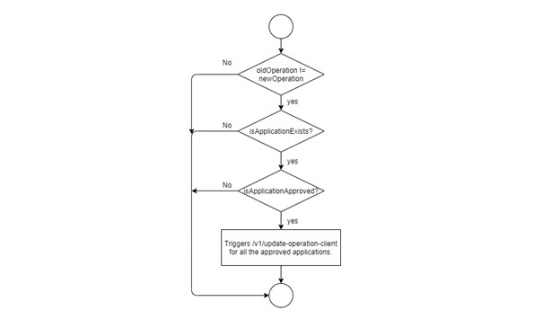
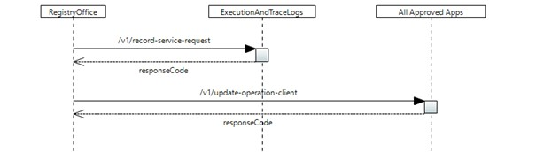

# /v1/relay-operation-update

(This document describes a sample implementation, which might be out of synch with actual implementation.)

Using this service , Registry office will broadcast an operation upgrade of an approved application to other approved applications in the SDN application layer.

## Configuration:

As per the specification , we are not supposed to update the version of an operation-client in registry office using this service. So, there will be no configuration required in the logical-termination-point and also this service don&#39;t manage any forwarding-construct.

## Forwarding:

After receiving the request, parallel notifications will be triggered for the following forwarding-constructs,

| **S.No** | **Forwarding-construct name** | **Details** |
| --- | --- | --- |
| 1 | OperationUpdateBroadcast All: /v1/update-operation-client | A trigger will be sent to all the approved applications. |
| 2 | ServiceRequestCausesLoggingRequestEaTL: /v1/record-service-request | A trigger will be sent to EaTL to record the service request. |

