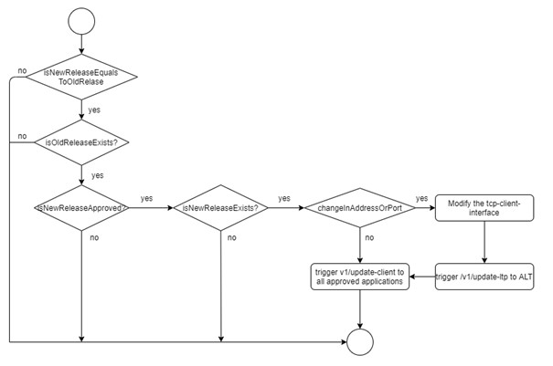
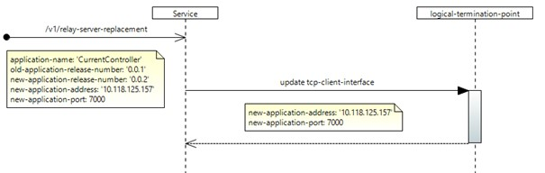
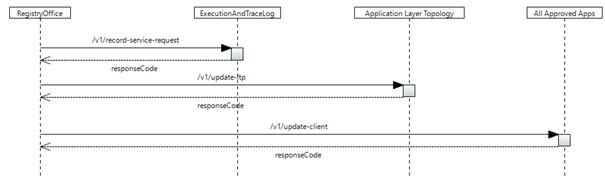

# /v1/relay-server-replacement

(This document describes a sample implementation, which might be out of synch with actual implementation.)

Using this service , Registry office will broadcast the software version upgrade of an existing application to other approved applications in the SDN application layer.

## Configuration:

Since the upgraded application information will be already available in the Registry Office , there will be no configuration required in the logical-termination-point and forwarding-construct. But , if there is a change in the application-address and application-port , then the corresponding tcp-client-interface will be configured with the latest values.

| **S.No** | **Layer protocol name** | **Details** |
| --- | --- | --- |
| 1 | tcp-client-interface | The new application ipaddress and port number will be configured updated. |

## Forwarding:

After receiving the request, parallel notifications will be triggered for the following forwarding-constructs,

| **S.No** | **Forwarding-construct name** | **Details** |
| --- | --- | --- |
| 1 | ServiceRequestCausesLtpUpdateRequestALT: /v1/update-ltp | If the tcp-client-interface gets updated with the latest value , then this service will be triggered. |
| 3 | ServerReplacementBroadcast All: /v1/update-client | A trigger will be sent to all the approved applications. |
| 4 | ServiceRequestCausesLoggingRequestEaTL: /v1/record-service-request | A trigger will be sent to EaTL to record the service request. |

