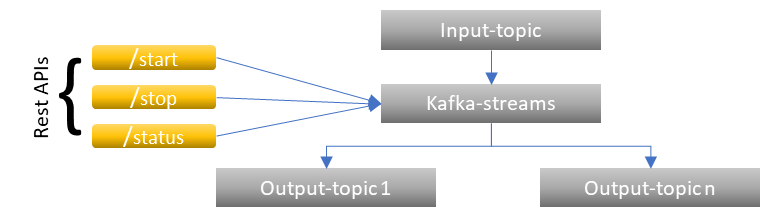

# KAFKA-STREAMS

Kafka Streams is a Java library for building real-time, scalable, and fault-tolerant stream processing applications on top of Apache Kafka.

This is a Java - spring boot application that incorporates kafka-streams. This acts as both consumer and producer to kafka.

The application when started consume JSON data from Kafka topics, perform operations on the data (like filter, map, group, join), and write the results back to the other Kafka topics.

## Configurations

- src/resources/application.properties shall be configured for kafka and streams based inputs

## Exposed Rest APIs

- POST **/streams/start**: Starts a new kafka-streams processing topology based on request-body's input. The process does the following:
  - Starts listening to kafka for new messages from given inputTopic
  - The consumed message will be categorized based on filter criteria given in request-body
  - These categorized messages are then sent to corresponding output topics
  - If any message not matching the filter rule, that message is thrown into other-notifications topic.

- POST **/streams/stop**: Stops the running stream process from listening or sending messages to kafka

- POST **/streams/status**: Checks if the stream process is running or stopped. 

_Note_: This is a single threaded application. This enables only one process to run at a time. 

## Steps to run the application

### Using JAR

1. Update src/resources/application.properties file for kafka related configuration details.
2. Reach to the src folder which contains pom.xml and run **mvn clean package**. This builds a JAR file in target folder.
3. Run the application using **java -jar target/kafka-streams.jar**
4. Then trigger /start command with appropriate inputs in request-body. Make sure the input and output topics are already created in kafka for smoother working.

Note: This could also be dockerised. For dockerizing, create a DockerFile with necessary configurations, build docker image and run the container.

## Reference

For project related workflow and detailed explanation: <https://github.com/openBackhaul/ApplicationPattern/blob/develop/doc/SharedComponents/Kafka/KafkaStreams.md>
