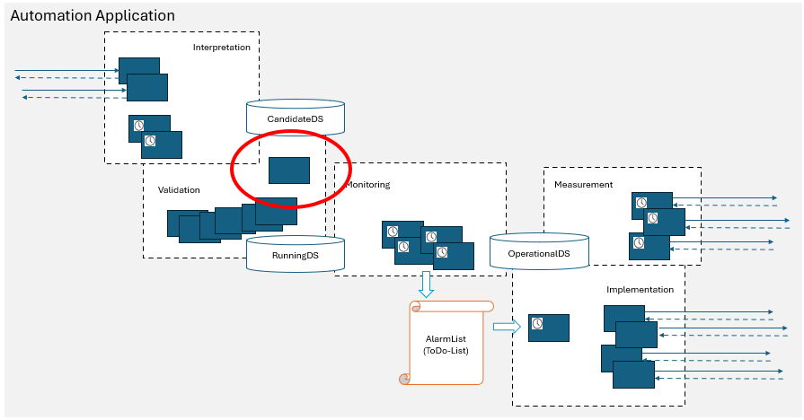

# ValidationOrchestrator

The ValidationOrchestrator is part of the state based design of automation applications.  

  

The ValidationOrchestrator shall be included as a module to your application.  
It is called by InterpretationFunctions (modules that translate incoming requests into changes to the CandidateDS) and it is responding the outcome of the validation back to the InterpretationFunctions.  
It allows to bind in any number of ValidationTestFunctions (Functions that check condition on the CandidateDS).  
It allows to flexibly combine the ValidationTestFunctions to be run after an InterpretationFunction and put them into a specific sequence.  
It returns a 204 in case all ValidationTestFunctions have passed or the ResponseCode of the first ValidationTestFunction that failed.  

Following are the steps to implement this concept. Also a sample implementation shall be find in the example folder.

## 1. Project Setup (Setup Phase)  

You shall have a following folder structure,  
 - A folder for the ValidationOrchestrator  
 - A folder for the individual ValidationTestFunctions  
 - An entry point (index.js or from a validation module) to test and run validation  

**Key Files:** (Example)  
 - /orchestrator/ValidationOrchestrator.js  
 - /validators/validate*.js  
 - /index.js  
	
## 2. Define & Register Validators  

- Create separate ValidationTestFunctions, each focused on what should be checked  
- Functions shall be asynchronous, as in some cases e have to interact with DB or application like MWDI  
- ValidationOrchestrator and ValidationTestFunctions shall be listed in the Function object, even if they would not have any parameter to be set  

## 3. Calling the ValidationOrchestrator  
The ValidationOrchestrator is called by the InterpretationFunctions.  
The calling InterpretationFunction is identified in the RequestBody.  
The ValidationOrchestrator is executing the sequence of ValidationTestFunctions that is described in the ValidationSequence object for this InterpretationFunction.  

_Could you please complement whatever would be useful_

Prepare the input data. 
Either using option 1 or option 2 the orchestrator shall be run.

**Option#1 :**
call orchestrator.run(data)
orchestrator:
 - Looks up all registered validators.
 - Executes them in registration order.
	
**Option#2 :**
call orchestrator.run(data, ['password', 'email'])
orchestrator:
 - Uses only the named validators.
 - Executes them in your specified sequence.

 
	
