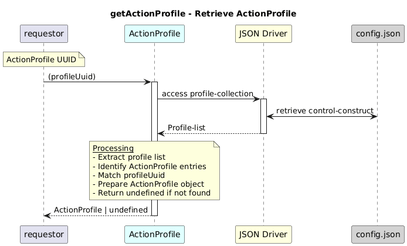

# getActionProfile  

### Overview  

Retrieves the ActionProfile associated with the given profile UUID.

### Description  
core-model-1-4:control-construct/profile-collection holds all the profiles. To retrieve the ActionProfile for a particular UUID, this function shall be used. It returns the capability and configuration details of the action profile.

**Module:**  
applicationPattern/onfModel/models/profile/ActionProfile.js

### **Inputs**
| Name | Type | Description |
|------|------|-------------|
| profileUuid | String |ActionProfile UUID (*-action-p-*)|

### **Output**
| Type | Description |
|------|-------------|
| ActionProfile| undefined| ActionProfile object if found; otherwise `undefined` |

### Interface  

NA 

### Diagram  

  

### NPM Module  

[onf-core-model-ap](https://www.npmjs.com/package/onf-core-model-ap)  
