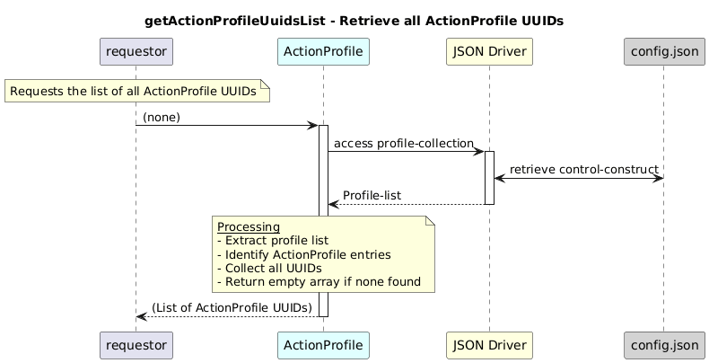

# getActionProfileUuidsList  

### Overview  

Retrieves the list of all ActionProfile UUIDs available in the profile collection.

### Description  
core-model-1-4:control-construct/profile-collection holds all the profiles. To retrieve the list of ActionProfile UUIDs, this function shall be used. It returns an array of UUIDs or an empty array if no action profiles exist.

**Module:**  
applicationPattern/onfModel/models/profile/ActionProfile.js

### **Inputs**
 none

### **Output**
| Type | Description |
|------|-------------|
|List of String |List of ActionProfile UUIDs, or empty array if none exist |

### Interface  

NA 

### Diagram  

  

### NPM Module  

[onf-core-model-ap](https://www.npmjs.com/package/onf-core-model-ap)  
