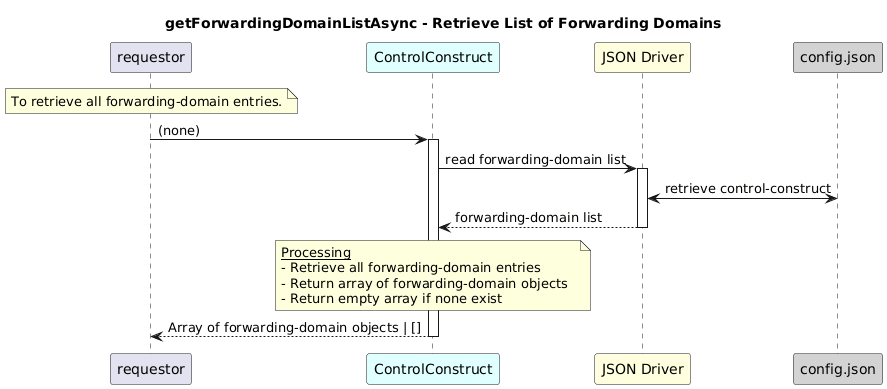

# getForwardingDomainListAsync  

### Overview  

Retrieves the complete list of forwarding-domain entries configured in the control-construct.

### Description  
core-model-1-4:control-construct/forwarding-domain holds all forwarding-domain instances.

This function returns the forwarding-domain list entries from the core-model-1-4:control-construct

**Module:**  
applicationPattern/onfModel/models/ControlConstruct.js

### **Inputs**
| Name | Type | Description |
|------|------|-------------|
| – | – | None |

### **Output**
| Type | Description |
|------|-------------|
| Array| Array of forwarding-domain objects |

### Interface  

NA 

### Diagram  

  

### NPM Module  

[onf-core-model-ap](https://www.npmjs.com/package/onf-core-model-ap)  
