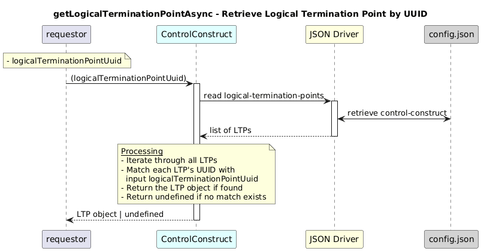

# getLogicalTerminationPointAsync  

### Overview  

Returns the LTP instance that matches the provided UUID.

### Description  
Each logical termination point under
core-model-1-4:control-construct/logical-termination-point
is uniquely identified by a UUID.

This function locates and returns the LTP matching the provided UUID.
If no matching LTP exists, it returns undefined.

**Module:**  
applicationPattern/onfModel/models/ControlConstruct.js

### **Inputs**
| Name | Type | Description |
|------|------|-------------|
| logicalTerminationPointUuid | String | UUID of the logical termination point|

### **Output**
| Type | Description |
|------|-------------|
| Object | LTP object if found |
|undefined |If no matching LTP exists |

### Interface  

NA 

### Diagram  

  

 

### NPM Module  

[onf-core-model-ap](https://www.npmjs.com/package/onf-core-model-ap)  
