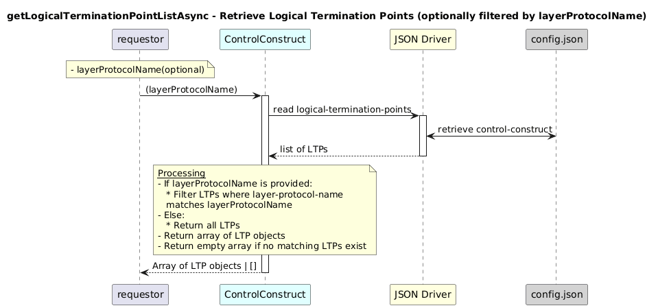

# getLogicalTerminationPointListAsync  

### Overview  

Retrieves all logical-termination-point entries. Filters by `layerProtocolName` if provided.

### Description  
core-model-1-4:control-construct/logical-termination-point contains all LTP instances.
This function returns:

all LTPs if layerProtocolName is not provided, or

only those LTPs whose layer-protocol name matches the provided value.

**Module:**  
applicationPattern/onfModel/models/ControlConstruct.js

### **Inputs**
| Name | Type | Description |
|------|------|-------------|
| layerProtocolName | String (optional) | Layer protocol name to filter LTPs. If undefined, returns all LTPs. |

### **Output**
| Type | Description |
|------|-------------|
| Array | List of matching logical termination point objects |

### Interface  

NA 

### Diagram  

  

### NPM Module  

[onf-core-model-ap](https://www.npmjs.com/package/onf-core-model-ap)  
