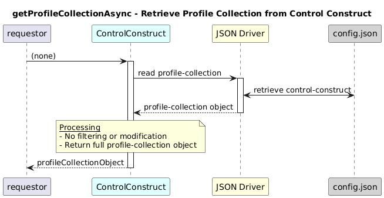

# GetProfileCollectionAsync  

### Overview  
Retrieves the complete profile-collection object from the control-construct.

### Description  

`core-model-1-4:control-construct/profile-collection` holds all ONF profile
instances, including:

- **ActionProfile**
- **FileProfile**
- **IntegerProfile**
- **StringProfile**
- **ResponseProfile**
- Other supported profile types

This function returns the **entire profile-collection object** exactly as stored,
without any modification or filtering.

**Module:**  
applicationPattern/onfModel/models/ControlConstruct.js

### **Inputs**
| Name | Type | Description |
|------|------|-------------|
| – | – | None |

### **Output**
| Type | Description |
|------|-------------|
| Object | Profile collection object |

### Interface  

NA 

### Diagram  

  

### NPM Module  

[onf-core-model-ap](https://www.npmjs.com/package/onf-core-model-ap)  
