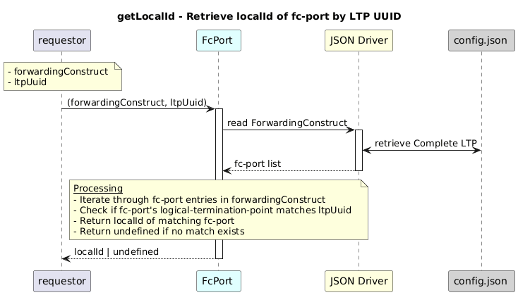

# GetLocalId  

### Overview  

Returns the `localId` of the fc-port in a forwarding-construct that matches the given LTP UUID.

### Description  

`/core-model-1-4:control-construct/forwarding-domain/forwarding-construct/fc-port`
holds the list of all **fc-port** instances for a forwarding-construct.

This function searches the fc-port list and returns the **local-id** of the
fc-port whose **logical-termination-point UUID** matches the provided value.

If no matching fc-port is found, the function returns **undefined**.

**Module:**  
applicationPattern/onfModel/models/FcPort.js

### **Inputs**
| Name | Type | Description |
|------|------|-------------|
| forwardingConstruct | Object | Forwarding-construct object containing fc-port entries |
| ltpUuid | String | Logical-termination-point UUID to match |

### **Output**
| Type | Description |
|------|-------------|
| String  | Local ID of the matching fc-port |
| undefined |    If no matching fc-port is found    |

### Interface  

NA 

### Diagram  

  

### NPM Module  

[onf-core-model-ap](https://www.npmjs.com/package/onf-core-model-ap)  
