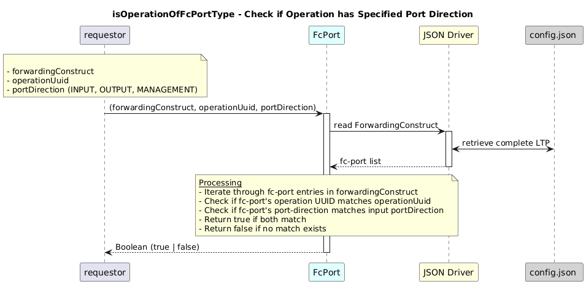

# isOperationOfFcPortType  

### Overview  

Checks if a given operation has the specified port direction in a forwarding-construct.

### Description 

`core-model-1-4:control-construct/forwarding-domain/forwarding-construct/fc-port`
contains all **fc-port** instances of a forwarding-construct.

This function updates the **logical-termination-point (LTP)** assigned to a
specific fc-port within a forwarding-construct.

It also validates that the provided **operation UUID** is associated with an
fc-port in the given forwarding-construct and that the fc-port has the specified
port direction:

- `INPUT`
- `OUTPUT`
- `MANAGEMENT`

This function is typically used to **validate operation roles** and ensure
correct port-direction mapping within forwarding logic.

**Module:**  
applicationPattern/onfModel/models/FcPort.js

### **Inputs**
| Name | Type | Description |
|------|------|-------------|
| forwardingConstruct | Object | Forwarding-construct object containing fc-port list |
| operationUuid | String | UUID of the operation LTP |
| portDirection | String | Port direction value as mentioned below |

   MANAGEMENT: "core-model-1-4:PORT_DIRECTION_TYPE_MANAGEMENT",
   INPUT: "core-model-1-4:PORT_DIRECTION_TYPE_INPUT",
   OUTPUT: "core-model-1-4:PORT_DIRECTION_TYPE_OUTPUT"

### **Output**
| Type | Description |
|------|-------------|
| Boolean | True if the operation has the matching port direction |

### Interface  

NA 

### Diagram  

  

 

### NPM Module  

[onf-core-model-ap](https://www.npmjs.com/package/onf-core-model-ap)  
