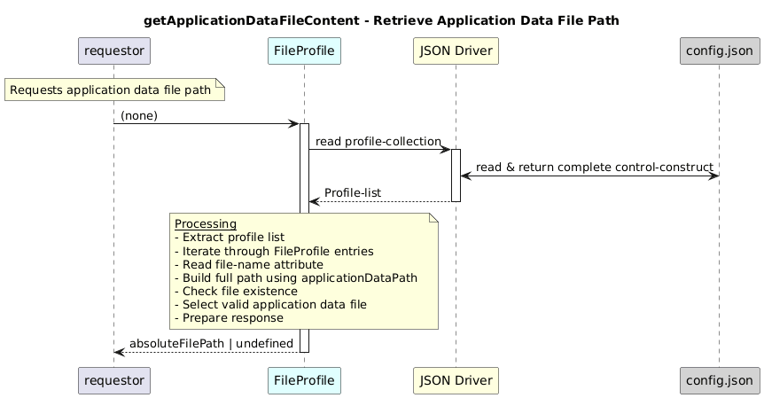

# getApplicationDataFileContent  

### Overview  

Returns the full path of the application data file if it exists in the file system.

### Description  
core-model-1-4:control-construct/profile-collection holds all the profiles. To retrieve the path of the application data file associated with a FileProfile, the getApplicationDataFileContent() function shall be used.

 This function iterates over all FileProfile UUIDs, fetches the file-name for each, and checks if the file exists in the applicationDataPath.

**Module:**  
applicationPattern/onfModel/models/profile/FileProfile.js

### **Inputs**
None

### **Output**
| Type | Description |
|------|-------------|
| String | Absolute path of the application data file |

### Interface  

NA 

### Diagram  

  

### NPM Module  

[onf-core-model-ap](https://www.npmjs.com/package/onf-core-model-ap)  
