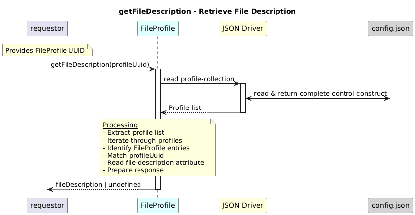

# GetFileDescription  

### Overview  

Returns the file description for the given FileProfile UUID.

### Description  

core-model-1-4:control-construct/profile-collection holds all the profiles. To retrieve the **file-description** value for a given  **FileProfile UUID**. that belongs to a particular  FileProfile , this function shall be used.

**Module:**  
applicationPattern/onfModel/models/profile/FileProfile.js

### **Inputs**
| Name | Type | Description |
|------|------|-------------|
| profileUuid | String | UUID of the FileProfile |

### **Output**
| Type | Description |
|------|-------------|
| String| File description |

### Interface  

NA 

### Diagram  

  

### NPM Module  

[onf-core-model-ap](https://www.npmjs.com/package/onf-core-model-ap)  
