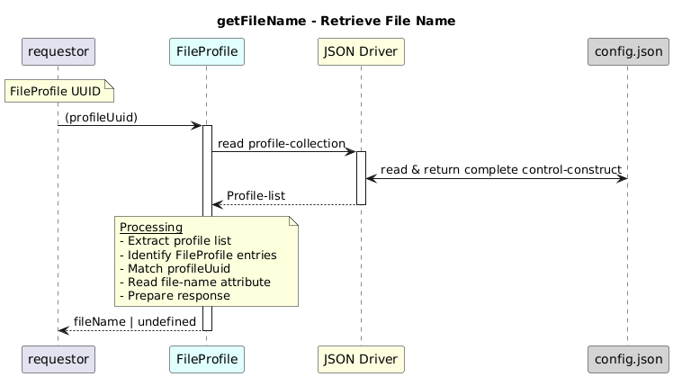

# getFileName  

### Overview  

Returns the file name for the given FileProfile UUID.

### Description  
core-model-1-4:control-construct/profile-collection holds all the profiles. To retrieve attributes of a file profile  file name for a particular FileProfile UUID this function will be used,

**Module:**  
applicationPattern/onfModel/models/profile/FileProfile.js

### **Inputs**
| Name | Type | Description |
|------|------|-------------|
| profileUuid | String | Profile UUID  |

### **Output**
| Type | Description |
|------|-------------|
| String | File name |

### Interface  

NA 

### Diagram  

  

### NPM Module  

[onf-core-model-ap](https://www.npmjs.com/package/onf-core-model-ap)  
