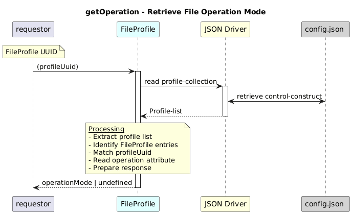

# GetOperation  

### Overview  

Retrieves the file operation mode configured for a FileProfile.

### Description  

core-model-1-4:control-construct/profile-collection holds all the profiles. To retrieve attributes of a file profile  operation for a particular FileProfile UUID this function will be used,

**Module:**  
applicationPattern/onfModel/models/profile/FileProfile.js

| Name | Type | Description |
|------|------|-------------|
| profileUuid | String | UUID of the FileProfile  |

### **Output**
| Type | Description |
|------|-------------|
| String | File operation mode (`READ_ONLY`, `READ_WRITE`, `OFF`, `NOT_YET_DEFINED`) |

### Interface  

NA 

### Diagram  

  

### NPM Module  

[onf-core-model-ap](https://www.npmjs.com/package/onf-core-model-ap)  
