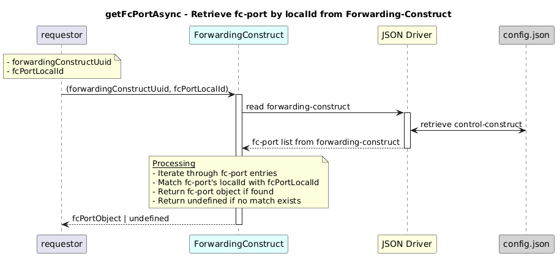

# getFcPortAsync  

### Overview  

Retrieves an fc-port instance that matches the given localId from its forwarding-construct.

### Description  

Each forwarding-construct contains a list of fc-port entries identified by a local-id.

This function reads the forwarding-construct under:
core-model-1-4:control-construct/forwarding-domain/forwarding-construct/fc-port

Retrieves a specific FcPort instance that matches the given localId from the forwarding-construct identified by its UUID.

If no matching fc-port is found, the function returns undefined.

**Module:**  
applicationPattern/onfModel/models/ForwardingConstruct.js

### **Inputs**
| Name | Type | Description |
|------|------|-------------|
| forwardingConstructUuid | String | UUID of the forwarding-construct|
| fcPortLocalId | String | Local ID of the fc-port |

### **Output**
| Type | Description |
|------|-------------|
| Object  | Matching fc-port object  |
|undefined|if    fc-port object not found |

### Interface  

NA 

### Diagram  

  

### NPM Module  

[onf-core-model-ap](https://www.npmjs.com/package/onf-core-model-ap)  

