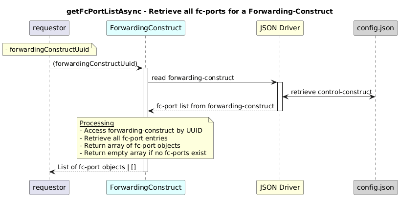

# GetFcPortListAsync  

### Overview  

Returns the complete list of fc-ports for a forwarding-construct.

### Description  

Each **forwarding-construct** contains a list of **fc-port** entries identified by a **local-id**.

This function reads the forwarding-construct under:  
**`core-model-1-4:control-construct/forwarding-domain/forwarding-construct/fc-port`**

It retrieves **all fc-port entries** without filtering by **port direction**.

**Module:**  
applicationPattern/onfModel/models/ForwardingConstruct.js

### **Inputs**
| Name | Type | Description |
|------|------|-------------|
| forwardingConstructUuid | String | UUID of the forwarding-construct |

### **Output**
| Type | Description |
|------|-------------|
| Array<Object> | List of all fc-port objects |

### Interface  

NA 

### Diagram  

  

### NPM Module  

[onf-core-model-ap](https://www.npmjs.com/package/onf-core-model-ap)  

