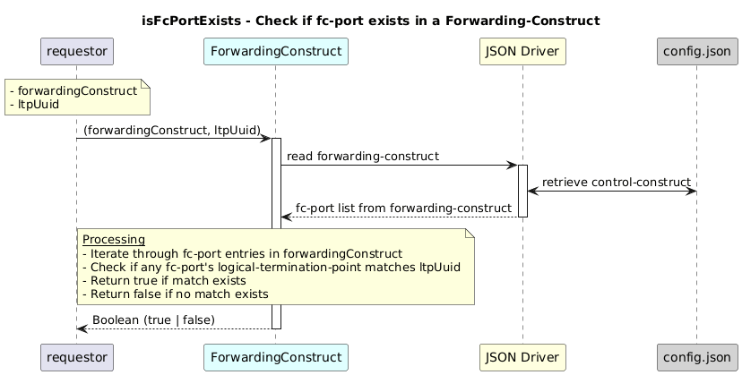

# isFcPortExists  

### Overview  

This function returns true if a fc-port is available in the forwarding-construct for the given input argument  fcLogicalTerminationPoint and forwardingConstructUuid.

### Description  

forwarding-construct under:
core-model-1-4:control-construct/forwarding-domain/forwarding-construct

Each forwarding-construct maintains a list of fc-port entries, where each fc-port is linked to a specific
logical-termination-point.

This function scans the fc-port list inside the provided forwarding-construct object and verifies whether any fc-port is already associated with the given LTP UUID.

**Module:**  
applicationPattern/onfModel/models/ForwardingConstruct.js

### **Inputs**
| Name | Type | Description |
|------|------|-------------|
| forwardingConstruct | Object | Forwarding-construct object containing fc-port list |
| ltpUuid | String | Logical-termination-point UUID |

### **Output**
| Type | Description |
|------|-------------|
| Boolean | True if fc-port exists; false otherwise |

### Interface  

NA 

### Diagram  

  

### NPM Module  

[onf-core-model-ap](https://www.npmjs.com/package/onf-core-model-ap)  

