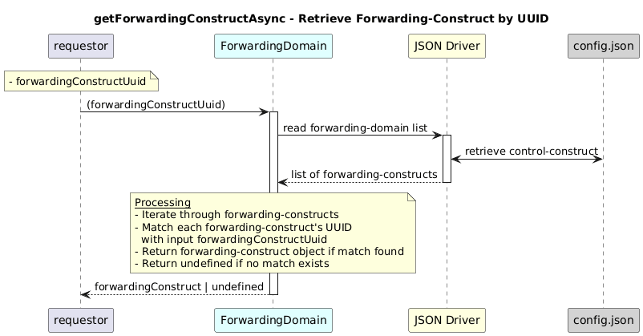

# GetForwardingConstructAsync  

### Overview  

Returns a ForwardingConstruct instance from the forwarding-domain list that matches the given forwardingConstructUuid.

### Description 

core-model-1-4:control-construct/forwarding-domain/forwarding-construct uniquely identifies each forwarding relationship using a UUID.

This function retrieves the forwarding-construct that matches the specified forwarding-construct UUID.

**Module:**  
applicationPattern/onfModel/models/ForwardingDomain.js

**Input:**  
Function inputs are:
| Parameter | Type | Description |
|----------|-------|-------------|
| forwardingConstructUuid |  string |UUID of the forwarding-construct |

**Output:**  
| Type | Description |
|------|-------------|
| `Object /undefined` |Forwarding-construct instance if found|

### Interface  

NA 

### Diagram  

  

 

### NPM Module  

[onf-core-model-ap](https://www.npmjs.com/package/onf-core-model-ap)  
