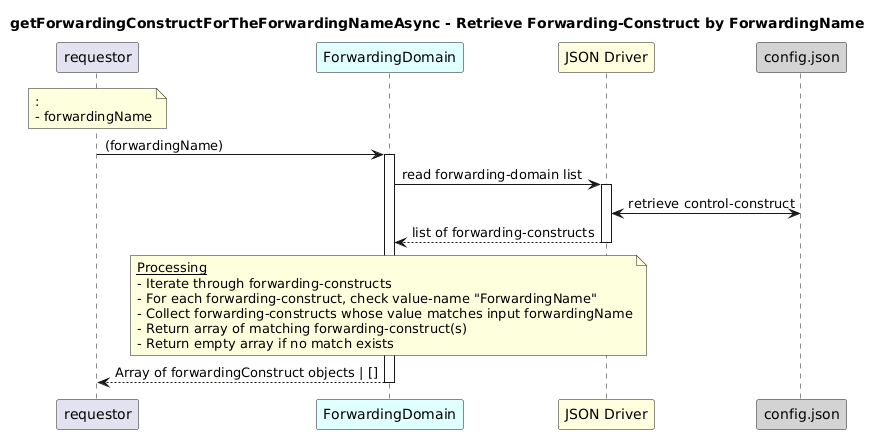

# getForwardingConstructForTheForwardingNameAsync  

### Overview  

Returns a ForwardingConstruct instance from the forwarding-domain list that matches the argument forwardingName.

### Description  

core-model-1-4:control-construct/forwarding-domain/forwarding-construct contains a name list where each forwarding-construct is identified by a ForwardingName.

This function retrieves the forwarding-construct whose value-name is ForwardingName and whose value matches the provided forwardingName.

**Module:**  
applicationPattern/onfModel/models/ForwardingDomain.js

**Input:**  
Function inputs are:
| Parameter | Type | Description |
|----------|-------|-------------|
|  forwardingName|  string |ForwardingName value of the forwarding-construct |

**Output:**  
| Type | Description |
|------|-------------|
| `List of Object` |Matching forwarding-construct instance|

### Interface  

NA 

### Diagram  

  

 

### NPM Module  

[onf-core-model-ap](https://www.npmjs.com/package/onf-core-model-ap)  
