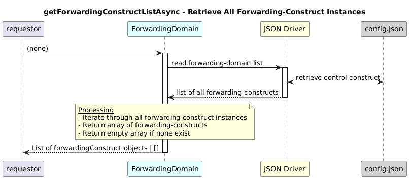

# getForwardingConstructListAsync  

### Overview  

Retrieves the complete list of all forwarding-construct instances configured in the control-construct.

### Description  

core-model-1-4:control-construct/forwarding-domain/forwarding-construct holds all forwarding-constructs configured in the system.

This function retrieves the complete list of forwarding-construct instances across all forwarding-domains.

**Module:**  
applicationPattern/onfModel/models/ForwardingDomain.js

**Input:**  
Function inputs are:
| Parameter | Type | Description |
|----------|-------|-------------|
| None |  - | -|

**Output:**  
| Type | Description |
|------|-------------|
| `Array<Object>` |List of all forwarding-construct instances|

### Interface  

NA 

### Diagram  

  

 

### NPM Module  

[onf-core-model-ap](https://www.npmjs.com/package/onf-core-model-ap)  
