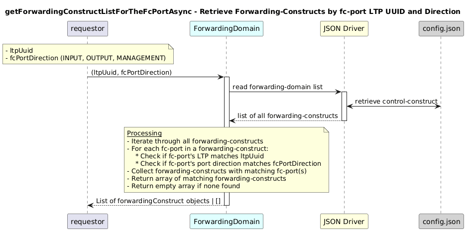

# GetForwardingConstructListForTheFcPortAsync  

### Overview  

Retrieves forwarding-constructs that contain an fc-port matching a given LTP UUID and port direction.

### Description  

core-model-1-4:control-construct/forwarding-domain/forwarding-construct contains multiple fc-ports, each linked to a logical-termination-point (LTP) and a port direction (INPUT, OUTPUT, MANAGEMENT).

This function returns all forwarding-constructs that include an fc-port whose logical-termination-point matches the given ltpUuid and whose port direction matches the specified direction.

**Module:**  
applicationPattern/onfModel/models/ForwardingDomain.js

**Input:**  
Function inputs are:
| Parameter | Type | Description |
|----------|-------|-------------|
| ltpUuid |  string |UUID of a logical-termination-point |
| fcPortDirection |  string | Port direction (INPUT, OUTPUT, MANAGEMENT)|

**Output:**  
| Type | Description |
|------|-------------|
| `Array of Object` |List of matching forwarding-construct instances|

### Interface  

NA 

### Diagram  

  

  

### NPM Module  

[onf-core-model-ap](https://www.npmjs.com/package/onf-core-model-ap)  
