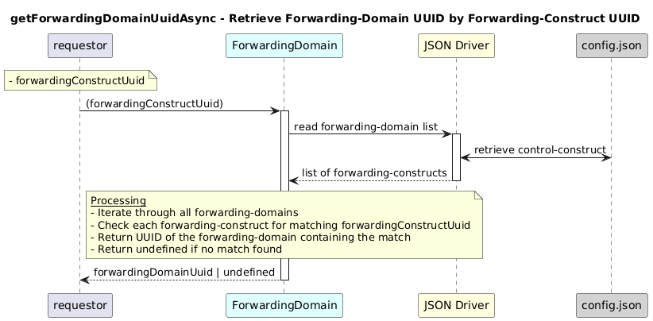

# GetForwardingDomainUuidAsync  

### Overview  
Returns the UUID of the forwarding-domain that contains the given forwarding-construct.

### Description 

core-model-1-4:control-construct/forwarding-domain contains forwarding-construct.
This function returns the UUID of the forwarding-domain that contains the forwarding-construct matching the given forwardingConstructUuid.

**Module:**  
applicationPattern/onfModel/models/ForwardingDomain.js

**Input:**  
Function inputs are:
| Parameter | Type | Description |
|----------|-------|-------------|
| forwardingConstructUuid |  string | UUID of the forwarding-construct|

**Output:**  
| Type | Description |
|------|-------------|
| `string / undefined` |UUID of the forwarding-domain|

### Interface  

NA 

### Diagram  

  

  

### NPM Module  

[onf-core-model-ap](https://www.npmjs.com/package/onf-core-model-ap)  
