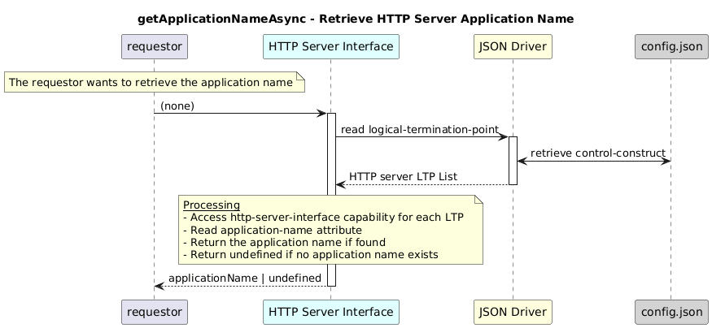

# GetApplicationNameAsync  


### Overview  

Retrieves the application name configured in the HTTP server capability.


### Description  

Each HTTP server Logical Termination Point (LTP) contains an HTTP server
layer-protocol with a capability block that describes the owning application.

The application name is stored at:

```text
core-model-1-4:control-construct/logical-termination-point/layer-protocol/
  http-server-interface-1-0:http-server-interface-pac/
    http-server-interface-capability/
      application-name
```

To retrieve the **server application-name**  this function shall be used.


**Module:**  
applicationPattern/onfModel/models/layerProtocols/HttpServerInterface.js.js

**Input:**  

None


**Output:**  
| Type | Description |
|------|-------------|
| `string` | Application name if present, else undefined|


### Interface  

NA 


### Diagram  

<p align="center">
  
</p> 

### NPM Module  

[onf-core-model-ap](https://www.npmjs.com/package/onf-core-model-ap)  
