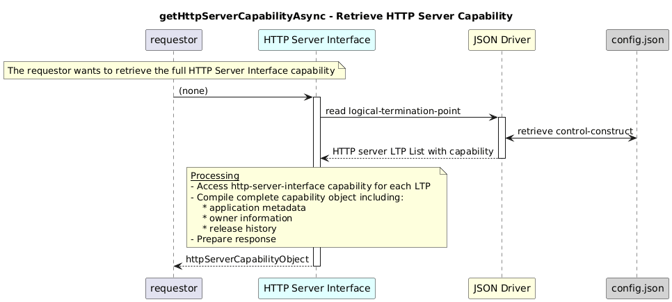

# getHttpServerCapabilityAsync  

### Overview  

Retrieves the complete HTTP Server Interface capability, including application metadata and release history.

### Description  

This function reads and returns the full capability object stored under:

/core-model-1-4:control-construct
  /logical-termination-point
    /layer-protocol
      /http-server-interface-1-0:http-server-interface-pac
        /http-server-interface-capability

**Module:**  
applicationPattern/onfModel/models/layerProtocols/HttpServerInterface.js

**Input:**  
None

**Output:**  
| Type | Description |
|------|-------------|
| `Object` | Full capability object containing application metadata, owner info, and release history |

### Interface  

NA 

### Diagram  

  

 

### NPM Module  

[onf-core-model-ap](https://www.npmjs.com/package/onf-core-model-ap)  
