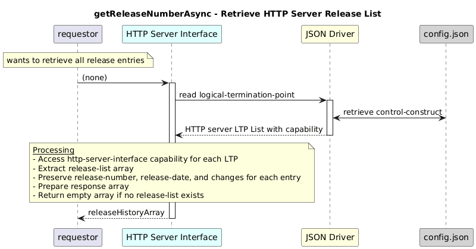

# GetReleaseNumberAsync  


### Overview  

Retrieves all release history entries for the HTTP server application.


### Description  

The release history is stored under:

```text
core-model-1-4:control-construct/logical-termination-point/layer-protocol/
  http-server-interface-1-0:http-server-interface-pac/
    http-server-interface-capability/
      release-list
```

This function reads the **release-list array** from the HTTP server capability
and returns a cleaned list of release entries.

For each release entry:

release-number, release-date, and changes are preserved
If no release list is configured, the function returns an empty array.

**Module:**  
applicationPattern/onfModel/models/layerProtocols/HttpServerInterface.js.js

**Input:**  
None


**Output:**  
| Type | Description |
|------|-------------|
| `Array` | Array of cleaned release history entries |


### Interface  

NA 


### Diagram  

<p align="center">
  
</p> 

### NPM Module  

[onf-core-model-ap](https://www.npmjs.com/package/onf-core-model-ap)  
