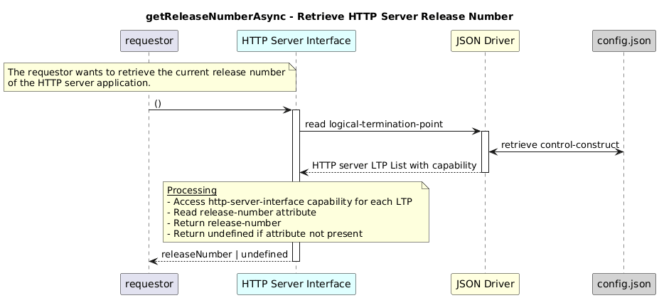

# getReleaseNumberAsync  

### Overview  

Retrieves the release number of the HTTP server application.

### Description  

Each HTTP server Logical Termination Point (LTP) contains an HTTP server
layer-protocol with a capability block that describes the owning application.

The release-number is stored at:

core-model-1-4:control-construct/logical-termination-point/layer-protocol/
  http-server-interface-1-0:http-server-interface-pac/
    http-server-interface-capability/
     release-number

To retrieve the server release-number this function shall be used.

**Module:**  
applicationPattern/onfModel/models/layerProtocols/HttpServerInterface.js.js

**Input:**  
None

**Output:**  
| Type | Description |
|------|-------------|
| `string` | Current release version, or undefined|

### Interface  

NA 

### Diagram  

  

 

### NPM Module  

[onf-core-model-ap](https://www.npmjs.com/package/onf-core-model-ap)  
