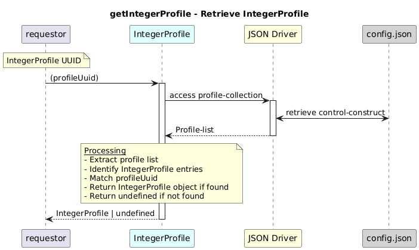

# GetIntegerProfile

### Overview  

Retrieves the complete IntegerProfile configuration and capability for a given profile UUID.

### Description  

core-model-1-4:control-construct/profile-collection holds all the profiles. To retrieve  the full **IntegerProfile object** this function shall be used.

**Module:**  
applicationPattern/onfModel/models/profile/IntegerProfile.js

### **Inputs**
| Name | Type | Description |
|------|------|-------------|
| profileUuid | String |UUID of the IntegerProfile |

### **Output**
| Type | Description |
|------|-------------|
| IntegerProfile  | IntegerProfile object if found  |
|undefined|If no matching profile exists |

### Interface  

NA 

### Diagram  

  

 

### NPM Module  

[onf-core-model-ap](https://www.npmjs.com/package/onf-core-model-ap)  
