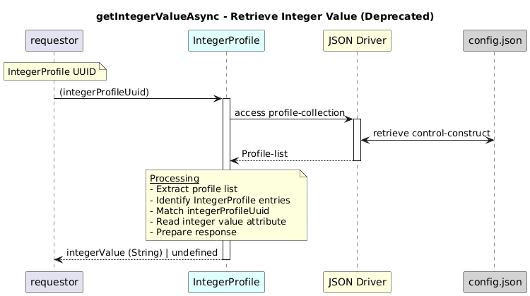

# GetIntegerValueAsync   

### Overview  

Returns the configured integer value for the given integer profile UUID.  
**@deprecated:** Use `getIntegerProfile` instead.

### Description  
core-model-1-4:control-construct/profile-collection holds all the profiles. To retrieve integer-value of an integer Profile object for a given profileUuid , this function shall be used. 

**Module:**  
applicationPattern/onfModel/models/profile/IntegerProfile.js

### **Inputs**
| Name | Type | Description |
|------|------|-------------|
| integerProfileUuid | UUID of the IntegerProfile |  |

### **Output**
| Type | Description |
|------|-------------|
| String | Configured integer value |

### Interface  

NA 

### Diagram  

  

 

### NPM Module  

[onf-core-model-ap](https://www.npmjs.com/package/onf-core-model-ap)  
