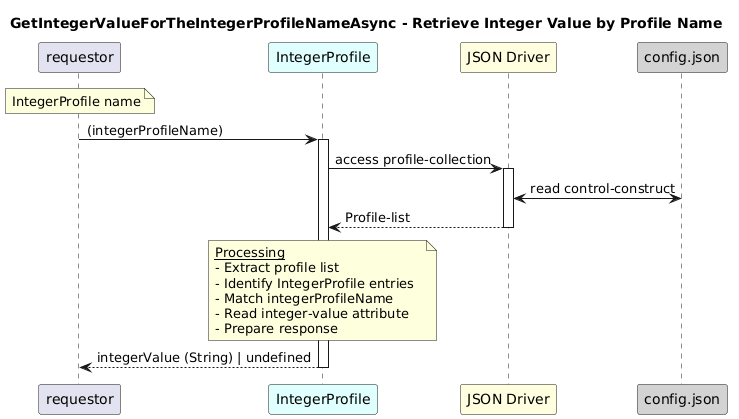

# GetIntegerValueForTheIntegerProfileNameAsync  

### Overview  

Retrieves the configured integer value for an IntegerProfile identified by its profile name.

### Description  
core-model-1-4:control-construct/profile-collection/profile holds all profile instances, including IntegerProfile entries.

This function searches the profile collection for an IntegerProfile whose integer-name matches the provided integerProfileName and returns its configured **integer-value**.

If no matching IntegerProfile is found, the function returns undefined.

**Module:**  
applicationPattern/onfModel/models/profile/IntegerProfile.js

### **Inputs**
| Name | Type | Description |
|------|------|-------------|
| integerProfileName | String | Name of the integer profile |

### **Output**
| Type | Description |
|------|-------------|
| String|Configured integer value if found |
| undefined|If no matching IntegerProfile exists|

### Interface  

NA 

### Diagram  

  

 

### NPM Module  

[onf-core-model-ap](https://www.npmjs.com/package/onf-core-model-ap)  
