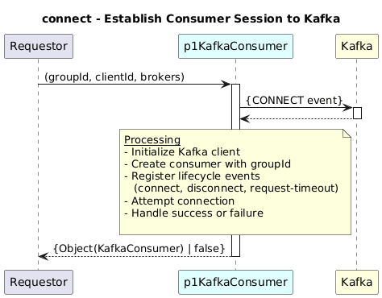

# Connect  

### Overview  

Establishes a connection to the Kafka broker and initializes a Kafka consumer instance.

### Description  

Creates a Kafka consumer using the provided client and broker configuration.
Handles connection events such as successful connection, timeout, and disconnection.

**Module:**  
applicationPattern/applicationPattern/services/KafkaConsumerService.js

### **Inputs**
| Name | Type | Description |
|------|------|-------------|
| groupId | String |Consumer group identifier|
| clientId | String | Kafka client identifier|
| brokers | String []|List of Kafka broker addresses|

### **Output**
| Type | Description |
|------|-------------|
| KafkaConsumer /boolean |  Returns Kafka consumer instance on success, false on failure |

### Interface  

NA 

### Diagram  

  

### NPM Module  

[onf-core-model-ap](https://www.npmjs.com/package/onf-core-model-ap)  
