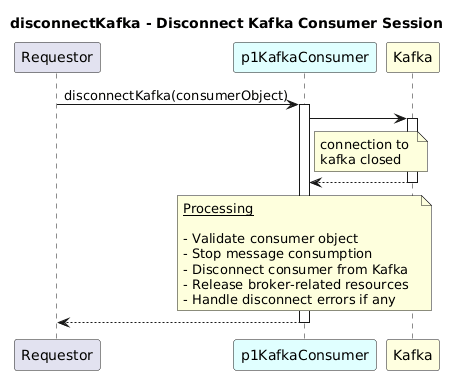

# DisconnectKafka  

### Overview  

Disconnects the Kafka consumer and releases all broker-related resources.

### Description  

Safely closes the Kafka consumer connection and stops message consumption.

**Module:**  
applicationPattern/applicationPattern/services/KafkaConsumerService.js

### **Inputs**
| Name | Type | Description |
|------|------|-------------|
| consumerObject | Object |Kafka consumer instance to disconnect|

### **Output**
| Type | Description |
|------|-------------|
| void | No return value |

### Interface  

NA 

### Diagram  

  

### NPM Module  

[onf-core-model-ap](https://www.npmjs.com/package/onf-core-model-ap)  
