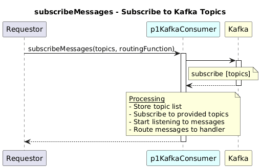

# SubscribeMessages  

### Overview  

Subscribes to Kafka topics and listens for incoming messages.

### Description  

Registers topic subscriptions and listens continuously for new messages in the topic.
Each new message is pulled and forwarded to the provided routing function where further parsing and processing happens.

**Module:**  
applicationPattern/applicationPattern/services/KafkaConsumerService.js

### **Inputs**
| Name | Type | Description |
|------|------|-------------|
| topics | String [] |List of Kafka topics to subscribe to|
| routingFunction | Function (message: any, topic: string) | Function invoked for each received message|

### **Output**
| Type | Description |
|------|-------------|
| void | No return value |

### Interface  

NA 

### Diagram  

  

### NPM Module  

[onf-core-model-ap](https://www.npmjs.com/package/onf-core-model-ap)  
